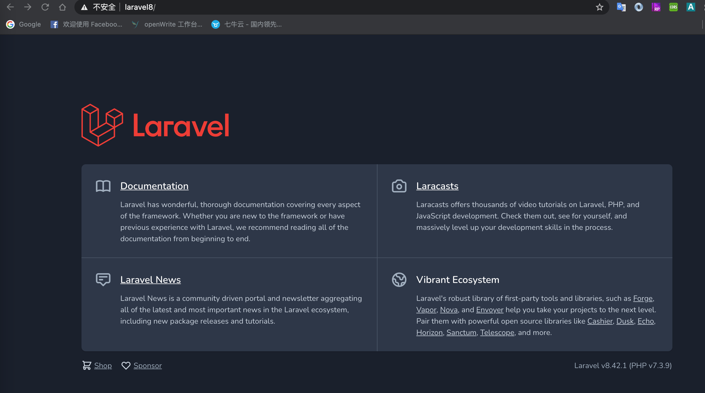

# 先把Laravel跑起来

要使用 Laravel 框架的话，先得使用 Composer ，关于 Composer 相关的文章，我们在最早的系列文章中就有讲解过。在这里也就不多说了，反正安装过程还是非常方便的，当然，如果你的网络对于外网不是太友好的话，也可以修改 Composer 的源为国内的镜像源。同时，我们也可以使用直接下载的方式来安装一个 Laravel 框架，但是最后还是会使用到 Composer 。

## 跑起来

安装好 Laravel 之后，我们可以使用一个命令：

```php
php artisan key:generate
```

这个命令是用于生成一个应用密钥，它会为我们的应用会话以及其它加密数据生成一个本应用相关的唯一密钥。当然，这个不是必需的，我们在这里只是提前说明一下，因为后面的入门相关的文章中我们还需要连接数据库、redis 之类的，并测试一下缓存相关的内容。

接下来，我们就可以使用一个命令：

```php
php artisan serve
```

使用这个命令就可以跑起来一个本地的测试服务器。这个测试服务器比较简单，可以让我们简单地运行测试，如果是正式的项目开发的话，还是在当前的系统环境中使用 Nginx 来配置会更好一些。这个我们下面再说。


从截图中可以看出，我们启动的服务器占用了 8000 端口。如果 8000 端口已经被占用的话，那么它还会依次地向后继续使用别的端口。

## 欢迎页面

打开本地的 8000 页面之后，我们看到的是上面那个 Laravel 的欢迎页面。现在打开 routes 目录下的 web.php 文件。我们可以看到这样的代码：

```php
Route::get('/', function () {
    return view('welcome');
});
```

这个就是我们路由文件中写的页面指向，返回的是 view() 这个方法中渲染的页面，那么这个页面在哪里呢？

这个 welcome 页面在我们的 resource 目录下的 views 目录中。打开 welcome.blade.php 这个文件，随便添加修改一些内容，再次刷新页面，我们就可以看到新修改的内容。

路由这块的功能和分析我们将在后面专门有几篇文章进行学习研究，这里就只是先看一眼而已。

## Nginx 运行 Laravel

Laravel 自带的这个服务器非常地简单，同时，在官方手册中，也推荐我们使用 Homestead 或者 Valet 来运行 Laravel 。但是，这些都和我们的实际开发会有些差距，所以最好的方式肯定还是用 Nginx 或者 Apache 来运行。

Nginx 的配置其实没有什么太多需要说的，root 目录指到 Laravel 框架中的 public 目录就可以了，因为我们的入口文件是 public 中的 index.php 文件。

除了目录的指向之外，我们还需要过滤掉 index.php 这个文件，也就是在链接中可以不用加这个 index.php 。

```php
location / {
    try_files $uri $uri/ /index.php?$query_string;
}
```

这个是什么意思呢？比如我们一开始不加这个的话，那么访问 Laravel 框架就需要是这样的链接：

```php
http://laravel8/index.php
```

而加上这个 location 重写之后，我们就可以直接使用：

```php
http://laravel8/
```

这个 laravel8 是我设置的本机访问的 hosts ，需要修改 hosts 文件并在 Nginx 配置文件中监听。



配置完成后，我们通过这个域名就可以直接访问 Laravel 框架了。后续的学习，我们也都是以这个配置为基础进行学习，不会使用自带的那个服务器。

## 单一入口

既然说到了单一入口这个问题，那么我们就来讲讲为什么现在的框架都要走这种单一入口的形式。

好处呢，很明显，一个入口可以让我们做很多事，一些提前的参数过滤，路由分发，架构加载都在这一个文件中完成了。缺点呢，也很明显，如果没有对应的路由机制，那么架构会很混乱。

这个问题，也是我之前遇到过的一个面试题，其实它的作用也就这么多。不管是 Laravel ，还是 TP 、Yii 之类的框架，都是单一入口的实现。在这里，也给大家留个作业，找找官方文档，如果我们是虚拟机部署的话，不能指向服务器目录到 public 的情况下，是如何运行 Laravel 框架的呢？其实答案很简单，而且就在 Laravel 的根目录中。

## 总结

今天的内容不多，主要就是 Laravel 框架的安装以及简单地服务器配置。如果你还没有接触过 Laravel 的话，务必自己给它搭起来。如果已经是老手了，那么忽略即可。

不够干？太简单没意思？别急，开胃菜而已，至少你得先把这个架子运行起来不是。下次的内容就要开始进入正戏了。

参考文档：

[https://learnku.com/docs/laravel/8.x/installation/9354#a05241](https://learnku.com/docs/laravel/8.x/installation/9354#a05241)