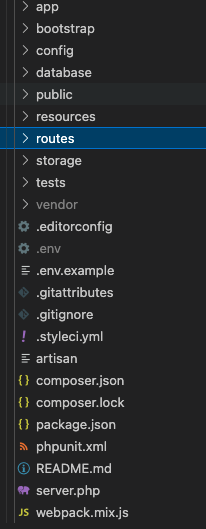
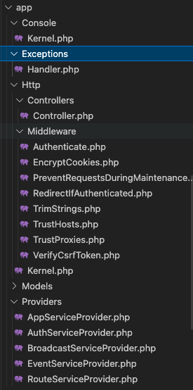
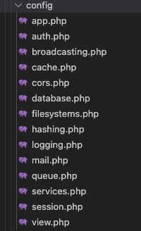

# Laravel 目录结构与配置

Laravel 的目录结构相对来说在初始状态下会更丰富一些，除了传统的控制器之外，也帮我们准备好了脚本、中间件之类的代码文件的目录，基本上是可以达到上手直接使用的。

## 目录结构

首先我们来看一看根目录都有什么。



其实根据名字就能知道这些目录的作用，比如说 app 目录是具体的应用代码。config 目录是存放配置文件信息的。在上篇文章中，我们提到过如果在虚拟机中使用 Laravel 的话，是需要用到 server.php 这个根目录下的文件的，其实这个文件就是在根目录下加载了 public/index.php 这个文件。

bootstrap 是在启动框架的时候需要加载的文件，一般不太会修改这个文件里面的内容，在这个目录下还包含 cache 相关的目录文件。database 很明显是数据库相关的内容。public 就是我们框架的入口目录，另外一些资源文件也可以放在这里，比如直接显示的图片、静态文件之类的。resources 存放的是视图和未编译的资源文件，我们在后面学习视图的时候会接触到。

routes 目录是我们的路由文件所存放的目录，这个目录很重要，当然，其实也就是这里面的路由文件很重要。它里面默认包含 web.php 、api.php 、channels.php 以及 console.php ，分别代表默认的 web 请求路由、api 请求路由、注册事件广播以及基于闭包的控制台脚本命令。这个我们在下一章节会详细讲解。

storage 目录是用于存储应用程序生成的各类文件，包括缓存、日志等信息。tests 目录包含自动化测试相关的内容。

在这些目录中，我们再重点看一下 app 目录中包含的内容。



app 目录是我们应用开发中使用最多的目录。我们应用的控制器、模型、中间件之类的内容都在这个目录中。

Console 目录是我们写的命令行脚本目录，也就是可以自定义的通过 php artisan 运行的命令行功能都在这个目录中。

Exceptions 是我们可以自定义的异常类。Models 中存放我们自定义的数据模型。Providers 目录中存放的是默认以及我们可以自定义的一些服务提供者。

接下来是 Http 目录。

Controllers 不用多说了，控制器都写在这里。Middleware 放的是默认的中间件，当然，我们自定义的中间件也可以写在这个目录里面。

Kernel.php 是请求内核的控制文件，在这个文件中，我们可以定义请求的中间件。这也是一个非常重要的核心文件，将来学习到的时候我们再详细的讲解说明。

## 配置文件

关于目录结构的内容其实就是上面这些，接下来我们再来看看配置文件也就是根目录下 config 目录里面的内容，这里面的内容也是我们经常需要接触到的。



其实从这些配置文件的名字就可以看出它们的作用。在接下来的文章我们马上就要接触到的就是 database.php 这个文件，因为在入门相关的内容中，我们还是要简单地连下数据库体验一下的。

在 database.php 中，不仅可以定义要连接的 mysql 数据库信息，也可以定义要连接的 NoSQL 类型的数据库（默认已经给了 redis 的连接配置）。我们这里先看下 MySQL 连接信息。

```php
'mysql' => [
    'driver' => 'mysql',
    'url' => env('DATABASE_URL'),
    'host' => env('DB_HOST', '127.0.0.1'),
    'port' => env('DB_PORT', '3306'),
    'database' => env('DB_DATABASE', 'forge'),
    'username' => env('DB_USERNAME', 'forge'),
    'password' => env('DB_PASSWORD', ''),
    'unix_socket' => env('DB_SOCKET', ''),
    'charset' => 'utf8mb4',
    'collation' => 'utf8mb4_unicode_ci',
    'prefix' => '',
    'prefix_indexes' => true,
    'strict' => true,
    'engine' => null,
    'options' => extension_loaded('pdo_mysql') ? array_filter([
        PDO::MYSQL_ATTR_SSL_CA => env('MYSQL_ATTR_SSL_CA'),
    ]) : [],
],
```

通过配置文件代码，我们可以看到很多信息都是通过 env() 这个函数获取的。而这个函数获取到的内容其实是根目录下的 .env 这个文件里面的内容。打开这个 .env 文件，我们可以看到它和 php.ini 文件的配置方式是相似的，都是 key=value 这种形式的配置信息。

```php
DB_CONNECTION=mysql
DB_HOST=127.0.0.1
DB_PORT=3306
DB_DATABASE=laravel
DB_USERNAME=root
DB_PASSWORD=
```

通过这里，我们就可以配置当前环境下的数据库连接信息。这样配置有什么好处呢？

独立的配置文件这种形式的很容易实现配置中心，也很容易实现测试环境和正式环境的分别部署。一般我们不会将这个 .env 放到 git 中，或者跟随代码上传。在正式环境或者测试环境都是手动地或者通过配置中心来进行配置。这样的话，我们就不需要修改源代码，只需要使用不同的这个 .env 配置文件就可以实现不同的环境下运行相同的代码了。

通过 XDebug ，我们可以追踪到 env() 这个方法在底层调用了 vlucas 的 DotEnv 这个 Composer 组件来进行 PHPENV 类型文件的读写加载。

对于加载来说，在程序运行的时候，我们会通过

```php
// laravel/framework/src/Illuminate/Foundation/Application.php
foreach ($bootstrappers as $bootstrapper) {
    $this['events']->dispatch('bootstrapping: '.$bootstrapper, [$this]);

    $this->make($bootstrapper)->bootstrap($this);

    $this['events']->dispatch('bootstrapped: '.$bootstrapper, [$this]);
}
```

中的这段代码来进行加载，核心是 $this->make($bootstrapper)->bootstrap($this); 这一段，它在循环中会加载所有 bootstrappers 数组中的内容，这个数组里面的内容是在 laravel/framework/src/Illuminate/Foundation/Http/Kernel.php 中的类变量 bootstrappers 所定义的。其中第一个环境变量启动加载器就是我们加载配置文件所需要的，如下所示：

```php
// laravel/framework/src/Illuminate/Foundation/Http/Kernel.php
/**
 * The bootstrap classes for the application.
 *
 * @var string[]
 */
protected $bootstrappers = [
    \Illuminate\Foundation\Bootstrap\LoadEnvironmentVariables::class,
    \Illuminate\Foundation\Bootstrap\LoadConfiguration::class,
    \Illuminate\Foundation\Bootstrap\HandleExceptions::class,
    \Illuminate\Foundation\Bootstrap\RegisterFacades::class,
    \Illuminate\Foundation\Bootstrap\RegisterProviders::class,
    \Illuminate\Foundation\Bootstrap\BootProviders::class,
];
```

源码中和代码中的 Bootstrap 相关的内容都是启动加载器的实现，从文件名就可以看出，这个启动加载器是加载环境变量相关内容的。.env 文件里面的配置信息也将是以整体的环境变量的形式加载到系统中。

```php
// laravel/framework/src/Illuminate/Foundation/Bootstrap/LoadEnvironmentVariables.php
$this->createDotenv($app)->safeLoad();
```

LoadEnvironmentVariables.php 中会通过上述代码进入到 DotEnv 组件中，通过

```php
// vlucas/phpdotenv/src/Dotenv.php
create() 

// vlucas/phpdotenv/src/Loader/Loader.php 
load()
```

这些方法读取配置文件相关的信息，最后通过 ServerConstAdapter.php 文件中的 write() 方法将这些配置文件中的信息写入到 $_SERVER 全局变量数组中。

```php
//vlucas/phpdotenv/src/Repository/Adapter/ServerConstAdapter.php 
/**
 * Write to an environment variable, if possible.
 *
 * @param string $name
 * @param string $value
 *
 * @return bool
 */
public function write(string $name, string $value)
{
    $_SERVER[$name] = $value;

    return true;
}
```

在路由文件中，我们可以通过打印 $_SERVER 数据看到配置文件里面我们配置过的信息。之后的读取，也直接是读取这个 $_SERVER 中的数据。

```php
Route::get('/', function () {
    var_dump($_SERVER);

    var_dump(env('REDIS_PASSWORD')); // null
    $_SERVER['REDIS_PASSWORD'] = '123456';
    var_dump(env('REDIS_PASSWORD')); // string '123456'
    
    return view('welcome');
});
```

其实反过来看，我们的 Laravel 就是将 .env 文件中的数据缓存到了全局变量 $_SERVER ，然后我们在将来使用的时候就直接从全局变量中获取就可以了，这样就可以避免下一次的文件读取从而提高系统效率。

## 总结

一开始以为就是简单地讲讲目录和配置文件，没想到吧，直接就进入源码的分析了。当然，这只是开胃菜而已。对于框架架构的学习，一定要配置好 XDebug 之类的调试工具，如果没这些工具，这种使用了许多 Composer 组件来回调用的代码还真不好找出最终实现的地方。

后面的文章也都会以这样的方式进行，需要注意的是，我们的源码都是在 vendor 目录下的，这个路径我就没有写了。

测试代码：


参考文档：

[https://learnku.com/docs/laravel/8.x/configuration/9355](https://learnku.com/docs/laravel/8.x/configuration/9355)
