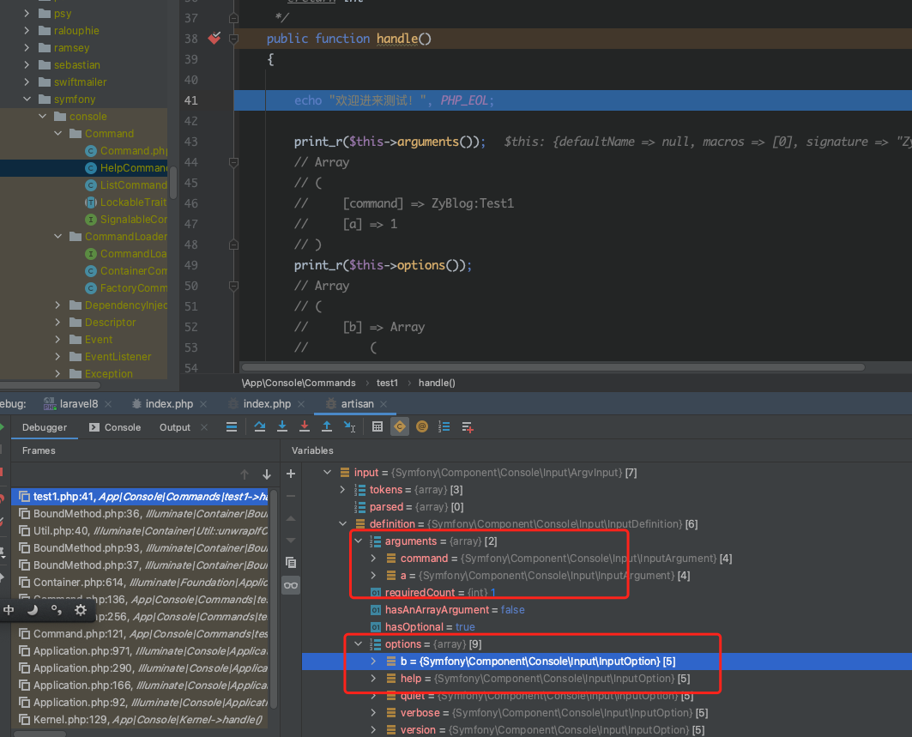

# Laravel运行命令行脚本

在上篇文章中，我们看到了 Laravel 中有个专门单独的目录，也就是 Console 目录，它是用于存放脚本文件的。这个脚本文件一般指的就是我们通过 php 命令来执行的命令行脚本，在许多框架中都有这样的功能。对于现代化的应用开发来说，一些数据统计、数据导出、队列处理等比较耗时的功能，以及一些自动化的后端运行程序，都需要使用这种命令行脚本来执行。

## 默认提供的脚本

在当前的框架目录中，我们在根目录执行 php artisan ，就可以看到命令行的帮助信息，这里就列出了所有已经存在的命令行脚本。第一篇文章中，我们就接触过这其中的两个命令。

```php
# php artisan key:generate

# php artisan serve
```

它们的作用一个是生成一个加密缓存等需要使用的唯一 Key ，另一个是运行一个自带的简易服务器。从脚本名称中我们可以看出，脚本可以以一个 : 分隔，冒号前面是大的分类，比如有 cache:xxx 相关的，也有 make:xxx 相关的。cache 相关的就是处理一些缓存信息的，而 make 相关的则是创建一些我们需要的文件，比如创建一个控制器可以使用 make:controller ，创建一个数据模型可以使用 make:model 。

关于这些默认自带的脚本，我们将在学习到相关内容的时候顺带着一起学习。

## 自定义一个脚本

自定义一个脚本非常简单。我们可以使用 make:command 命令来生成一个命令行脚本。

```php
# php artisan make:command test1
Console command created successfully.
```

这时，在 app/Console/Commands 目录下就会出现一个 test1.php 文件。打开这个文件，我们需要做一些修改。

```php
/**
 * The name and signature of the console command.
 *
 * @var string
 */
protected $signature = 'command:name';

/**
 * The console command description.
 *
 * @var string
 */
protected $description = 'Command description';
```

signature 用于设定当前这个脚本的名称，description 用于定义脚本的注释说明。它们用在什么地方呢？其实 signature 就是我们通过 php artisan 来运行这个脚本时所需要用到的那个名称。比如我们现在直接执行 php artisan 的话，就会看到下面这样一条可执行命令行脚本的出现。

```php
 command
  command:name         Command description
```

当然，使用这个默认的名称并不是好的主意，所以我们可以修改一下这两个属性。

```php
/**
 * The name and signature of the console command.
 *
 * @var string
 */
protected $signature = 'ZyBlog:Test1';

/**
 * The console command description.
 *
 * @var string
 */
protected $description = '硬核测试1';
```

这个时候我们再运行 php artisan 的话，就可以看到我们定义的信息了。

```php
 ZyBlog
  ZyBlog:Test1         硬核测试1
```

如果要运行这个脚本也非常简单。

```php
# php artisan ZyBlog:Test1
```

当然，我们还什么都没做呢，所以不会有什么输出。接下来我们把接收参数和输出信息一起做了。接收参数需要在 signature 中定义我们要接收的参数及选项。还记得我们之前讲过的在 PHP 中如何接收脚本参数及选项信息的文章吗？Laravel 已经将这些封装好了，不需要再去使用那些函数来进行接收处理，直接使用就可以了。需要复习的同学可以移步 【如何获取PHP命令行参数】[https://mp.weixin.qq.com/s/dFuGaM1JTtYEOuDUOaZ04Q](https://mp.weixin.qq.com/s/dFuGaM1JTtYEOuDUOaZ04Q) 进行复习或学习。

```php
protected $signature = 'ZyBlog:Test1 {a=1} {--b=*}';


/**
 * Execute the console command.
 *
 * @return int
 */
public function handle()
{

    echo "欢迎进来测试！", PHP_EOL;

    print_r($this->arguments());
    // Array
    // (
    //     [command] => ZyBlog:Test1
    //     [a] => 1
    // )
    print_r($this->options());
    // Array
    // (
    //     [b] => Array
    //         (
    //             [0] => 2
    //         )
    
    //     [help] => 
    //     [quiet] => 
    //     [verbose] => 
    //     [version] => 
    //     [ansi] => 
    //     [no-ansi] => 
    //     [no-interaction] => 
    //     [env] => 
    // )

    echo $this->argument('a'); // 1
    print_r($this->option('b'));
    // Array
    // (
    //     [0] => 2
    // )

    return 0;
}
```

在 handle() 函数中，我们可以编写当前这个脚本需要执行的功能代码。其中，通过 arguments() 和 argument() 可以接收到脚本的参数信息，通过 options() 和 option() 可以接收到脚本的选项信息。关于参数和选项的问题，之前的文章中我们也讲解过了，这里也就不多说了，一切都是以基础为准的。

## 参数选项源码分析

对于参数和选项来说，Laravel 的底层调用的其实是 symfony 的 Console 组件，在 symfony/console/Input/ArgvInput.php 中，我们可以看到下面这些代码。

```php
public function __construct(array $argv = null, InputDefinition $definition = null)
{
    $argv = $argv ?? $_SERVER['argv'] ?? [];

    // strip the application name
    array_shift($argv);

    $this->tokens = $argv;

    parent::__construct($definition);
}
// ……………………
// ……………………
protected function parse()
{
    $parseOptions = true;
    $this->parsed = $this->tokens;
    while (null !== $token = array_shift($this->parsed)) {
        if ($parseOptions && '' == $token) {
            $this->parseArgument($token);
        } elseif ($parseOptions && '--' == $token) {
            $parseOptions = false;
        } elseif ($parseOptions && 0 === strpos($token, '--')) {
            $this->parseLongOption($token);
        } elseif ($parseOptions && '-' === $token[0] && '-' !== $token) {
            $this->parseShortOption($token);
        } else {
            $this->parseArgument($token);
        }
    }
}
```

很明显，在 symfony 中，也是使用的 argv 获取参数和选项，然后将它们放到 input 变量中向下传递。这个 input 变量很重要，后面我们在学习请求相关的内容时也会接触到。之后在我们的执行代码中，也就是 Command 的 handle() 方法中使用 argument() 或者 option() 获取到的就是这个 input 中的数据。从断点调试中我们就可以看到它们的身影。



那么 Laravel 是如何执行 handle() 函数的呢？首先通过 artisan 文件调用到 laravel/framework/src/Illuminate/Foundation/Console/Kernel.php 文件，在这个 Kernel.php 中的 handle() 方法中会调用 symfony/console/Application.php ，接着进入 laravel/framework/src/Illuminate/Console/Command.php 中执行 execute() 方法，通过回调的方式调用我们自定义的那个 handle() 方法。

注意，在 laravel/framework/src/Illuminate/Console/Command.php 的底层还是调用的 symfony 下面的 console/command.php 里面的方法。

整个调用链条非常长，不过也可以清晰地看出我们的 Laravel 确实就是在 Symfony 的基础上又套了层壳。而且不仅仅是命令行这里，在 Web 请求这一块，依然底层还是 Symfony 在发挥着至关重要的作用。

上面的写得太笼统了，自己找不到调用路径？不用怕，等着看视频哈！

## 总结

感觉有点意思吗？这里我们只是简单地入门并且自定义了一个测试脚本，脚本这块还有很多别的功能，我们将在后面的文章中继续学习到。现在都还只是开胃菜，正餐还没上桌呢，所以还请持续关注后续的精彩内容哦！

参考文档：

[https://learnku.com/docs/laravel/8.x/artisan/9387](https://learnku.com/docs/laravel/8.x/artisan/9387)
