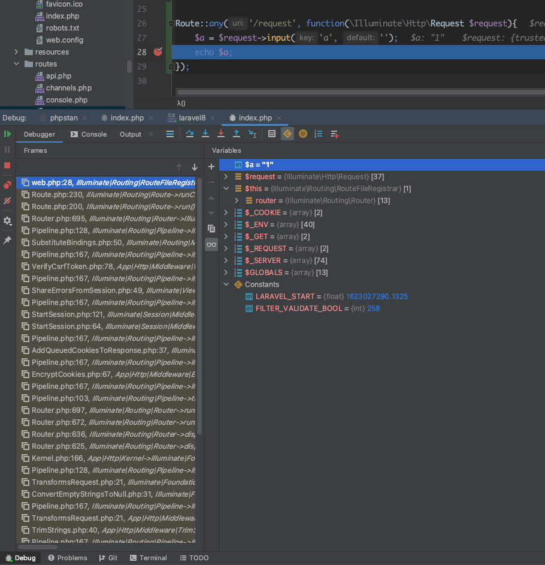
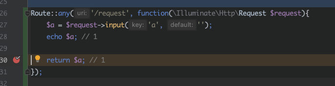
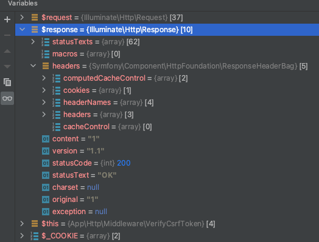

# 一个请求的前世今生

在 Laravel 的世界中，请求和响应是非常重要的环节，虽说我们讲的是一个请求的前世今生，但这个请求最后的结果往往体现在一个响应中，所以我们就一起学习请求和响应这两方面的内容。

请求，体现在 Laravel 框架中的 request 中，这个 Request 对象在底层是 Symfony 的一个 RequestBag 包，它将贯穿整个框架几乎所有加载的对象中，能够被我们的控制器、中间件捕获调用。

## 请求的路径

我们分开来看请求的调用路径。这个调用路径，也就是从浏览器发出一个请求到我们要处理这个请求的路由或者控制器，看看这个请求都经历了哪些地方，走过了哪些路。



我们以路由中的处理为例，可以看到一个简单的请求走到路由中就经历过了这么多的类和方法的处理。所以我们常说 Laravel 的慢就是慢在了这里。当然，这也是之前就说过的，为了“优雅”而放弃的性能。

仔细查看左侧我们请求一路过来调用的各个文件，会发现很多的 Pipeline.php ，也会发现有很多是包含 Middleware 目录的文件。Pipeline 是管道的意思，对应的其实是 Linux 命令行中的管道的概念，而在设计模式中，对应的其实是一种 *责任链模式* 的实现。管道最主要的能力就是对于中间件的处理，而责任链在实现的时候，遵循的就是类似于中间件这样的一种概念，让请求依次经过每个中间件，需要处理的就处理，不需要处理的就路过。对于这里的概念，我们在后面核心架构中还会详细的讲解，大家如果对设计模式还不是很熟悉的话，可以先去复习一下 [PHP设计模式之责任链模式]() 。学习 Laravel ，设计模式非常重要，它里面的很多功能都是各种模式的组合实现，需要大家对设计模式有一定的理解。

在责任链中，一直不停传递的就是这个 Request 这个对象。它是通过依赖注入注入到当前这个路由的回调函数里的。关于依赖注入的问题也是我们后面再深入学习的内容，这里也只是做个了解铺垫。通过不断地注入，让这个 request 参数在中间件中不停地穿梭处理，最后到达路由或者控制器。由于我们今天的测试只是在路由进行处理，所以看不到控制器的处理，这点我们将在后面学习控制器的文章中再次学习到。

可以最后总结一下，一个请求的路径，从 入口文件index.php ，进入到 Kernel 内核之后，就是一直在 Pipeline 管道中不断地使用中间件进行处理，最终达到 路由 或者 控制器 。简单地来看，请求的传递就是这样一个链条，理论上并不长，但中间件的多少决定了它的路途是否遥远。

## 请求的参数

对于请求来说，我们从 request 里获取到了请求的参数，这也是我们主要要看的内容。从调试的信息来看，其实从传统的 $_REQUEST 、$_POST、$_GET 这些全局变量中也可以获取到参数信息，为什么我们要从 request 中获取呢？

其实，许多框架都会建议从他们封装的参数获取函数中取得参数信息。一般这些框架都会对请求进行一些参数验证、数据保护过滤的操作。同时，在 Laravel 中，我们在中间件中也可以获取到这些参数，整个 request 是贯穿所有的框架对象的，也就是它在整个请求生命周期中都是存在的，并且一直是向下传递的。

我们先来看看这个请求参数是如何封装的，我们是如何获取的。

## 请求的封装与获取

请求参数的获取，是通过调用 request->input() 这个方法，实际调用的是 laravel/framework/src/Illuminate/Http/Concerns/InteractsWithInput.php 这个文件中的 input() 方法，它会继续调用 symfony/http-foundation/InputBag.php 中的 all() 方法。为什么是 all() 方法呢？因为我们没指定是 get 还是 post 来的数据。

在 request 中，有对应的 get() 和 post() 方法，同时也存在一个 all() 方法。普通的 all() 方法返回的是一个参数的数组，大家可以直接打印出来看一下。而 input() 方法则是从 all() 中取出一个指定名称的参数信息。input() 是非常强大的一个函数，它不仅仅是可以取 get、post 里面的数据，还可以获取 body 中格式化的 json 数据，前提是 header 头中指定请求是 application/json 格式。这个作为拓展知识，大家自己找资料尝试一下吧。

接下来就是通过 symfony/http-foundation/ParameterBag.php 中的 all() 方法获取参数的值。

整个调用过程在底层依然使用的是 Symfony 框架来进行请求的处理。并将所有的请求数据封装成一个 Bag 类型的对象。我们所有的参数都是从这个对象里面的属性中取得的。大家在调试过程中，可以看到请求参数都在 InputBag 的 parameters 属性中。

那么，这个属性是在什么时候获得参数信息的呢？

在我们的入口文件 public/index.php 中，调用了 Request::capture() 这个静态方法。在这个静态方法中，继续调用 static::createFromBase(SymfonyRequest::createFromGlobals()); 这个方法来将所有的参数变量保存到 request 中。进入 createFromBase() 方法所需要的参数，也就是 SymfonyRequest::createFromGlobals() 方法，我们将看到这样的代码。

```php
public static function createFromGlobals()
{
    $request = self::createRequestFromFactory($_GET, $_POST, [], $_COOKIE, $_FILES, $_SERVER);

    if ($_POST) {
        $request->request = new InputBag($_POST);
    } elseif (0 === strpos($request->headers->get('CONTENT_TYPE', ''), 'application/x-www-form-urlencoded')
        && \in_array(strtoupper($request->server->get('REQUEST_METHOD', 'GET')), ['PUT', 'DELETE', 'PATCH'])
    ) {
        parse_str($request->getContent(), $data);
        $request->request = new InputBag($data);
    }

    return $request;
}
```

其中第一行代码就可以看到，通过 createRequestFromFactory() 这个静态方法，我们将整个请求的所有数据，包括 get、post、cookie、files、server 都
传递了进去，而在 createRequestFromFactory() 做了什么呢？将这些数据实例化成了一个 symfony/http-foundation/Request.php 对象。不同的参数分别实例化成了不同的 Bag 属性。比如我们这里的 get 请求的参数就放到了 InputBag 对应的一个 query 属性中。post 放到了 ParameterBag 对应的 request 属性中。这一切都发生在 symfony/http-foundation/Request.php 中的 initialize() 里面。

```php
public function initialize(array $query = [], array $request = [], array $attributes = [], array $cookies = [], array $files = [], array $server = [], $content = null)
{
    $this->request = new ParameterBag($request);
    $this->query = new InputBag($query);
    $this->attributes = new ParameterBag($attributes);
    $this->cookies = new InputBag($cookies);
    $this->files = new FileBag($files);
    $this->server = new ServerBag($server);
    $this->headers = new HeaderBag($this->server->getHeaders());

    $this->content = $content;
    $this->languages = null;
    $this->charsets = null;
    $this->encodings = null;
    $this->acceptableContentTypes = null;
    $this->pathInfo = null;
    $this->requestUri = null;
    $this->baseUrl = null;
    $this->basePath = null;
    $this->method = null;
    $this->format = null;
}
```

果然一切都是面向对象啊，不管怎么样，最后我们都是在对象的世界里去操作获取这些数据。这也是使用框架的魅力，通过对源码的分析，我们见识到了 Laravel 中对于数据的处理也全部都是通过对象的方法来进行的。

## 响应的返回

一个请求的最终归宿是我们代码的处理。代码处理完业务逻辑之后，需要打印数据进行展示，这个过程其实就是一次响应的过程。有请求，有响应，构成了一个完整的数据 请求/响应 模型。

对于大部分的调试来说，我们直接 echo 返回的数据就可以了，但从框架的角度来说，Laravel 中对于响应也是使用对象来操作的，这个对象就是 Response 对象。

我们在路由中可以直接 return 一个字符串，也可以 return view() 或者 return response->json() ，对应的返回的内容正是一个 Response 对象。



使用断点调试，会发现这个 return 之后会进入到 laravel/framework/src/Illuminate/Routing/Router.php 的 prepareResponse() 方法中，一路向下，会发现它进入到了 laravel/framework/src/Illuminate/Http/Response.php 中，并且实例化了一个这个对象。Response 对象继承自 Symfony 的 Response 类。

在 Response 对象中，我们会将数据保存在 ResponseBag 中，和 Reqeust 非常类似，这个 ResponseBag 中会携带响应的头信息、HTTP状态信息、数据信息，最后输出到浏览器。



在处理响应的过程中，还会进入到一些 next() 提前的中间件用于处理一些响应事件的数据，这个我们在学习中件间的时候会再提到。

```php
$response = tap($kernel->handle(
    $request = Request::capture()
))->send();
```

最后，在 index.php 中，我们通过这段代码调用 symfony/http-foundation/Response.php 的 send() 方法将数据输出。

```php
public function sendHeaders()
{
    // headers have already been sent by the developer
    if (headers_sent()) {
        return $this;
    }

    // headers
    foreach ($this->headers->allPreserveCaseWithoutCookies() as $name => $values) {
        $replace = 0 === strcasecmp($name, 'Content-Type');
        foreach ($values as $value) {
            header($name.': '.$value, $replace, $this->statusCode);
        }
    }

    // cookies
    foreach ($this->headers->getCookies() as $cookie) {
        header('Set-Cookie: '.$cookie, false, $this->statusCode);
    }

    // status
    header(sprintf('HTTP/%s %s %s', $this->version, $this->statusCode, $this->statusText), true, $this->statusCode);

    return $this;
}

public function sendContent()
{
    echo $this->content;

    return $this;
}

public function send()
{
    $this->sendHeaders();
    $this->sendContent();

    if (\function_exists('fastcgi_finish_request')) {
        fastcgi_finish_request();
    } elseif (!\in_array(\PHP_SAPI, ['cli', 'phpdbg'], true)) {
        static::closeOutputBuffers(0, true);
    }

    return $this;
}
```

可以看到，在底层，归根结底还是通过 header() 和 echo 来将数据最终输出到浏览器的。

当然，我们只是研究了一下直接返回字符串的 Response 过程，其它的如 view() 返回模板的过程会更复杂一些，因为还要牵涉到视图模板数据的解析编译以及缓存。不过，整体的原理和步骤都是类似的，有兴趣的小伙伴可以自己调试一下。

## 总结

从一个请求的路径开始，到请求参数的底层代码分析，最后到一个响应的结束。一个请求的前世今生就被我们分析完了。当然，在这里只是点出了一些关键位置的关键代码，更详细的内容还是需要大家自己调试去的，在这个过程中，说不定还能发现更好
玩的东西哦！

测试代码：

参考文档：

[https://learnku.com/docs/laravel/8.x/responses/9370](https://learnku.com/docs/laravel/8.x/responses/9370)

[https://learnku.com/docs/laravel/8.x/lifecycle/9360](https://learnku.com/docs/laravel/8.x/lifecycle/9360)

[https://learnku.com/docs/laravel/8.x/requests/9369](https://learnku.com/docs/laravel/8.x/requests/9369)