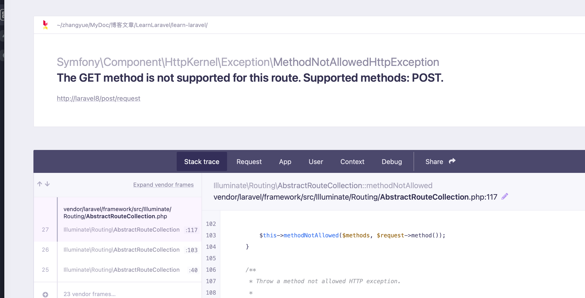
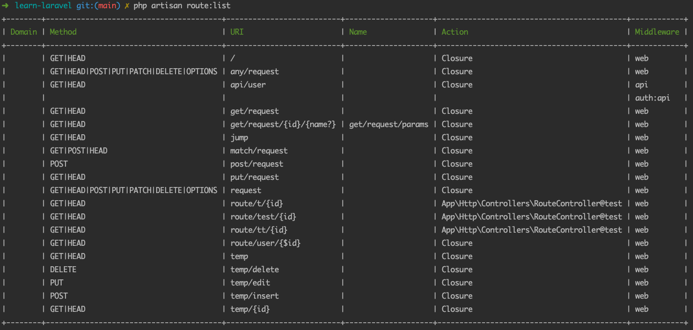

# 路由：指哪儿打哪儿

在没有接触到 Laravel 之前，早先的框架基本上都没有这个完整的路由的概念。像是 TP3 、Yii1 版本的时候，都是通过入口文件对参数的解析来加载指定的 控制器 。关于这种形式的加载方式大家可以在去看一下老的这些框架是如何实现的。而在 Laravel 中，从我开始接触的时候，就使用的是自定义路由的方式来指定请求的路径。其实，传统方式可以看做是一种隐式路由，而我们需要写的这种是一种显式的路由。Laravel 也是支持隐式路由的，只是它并不推荐这么做。那么，显式路由有什么好处呢？

- Restful 风格的 URL

- 多个 URI 指向同一个控制器（可以在路由中区分参数）

- URI 和 控制器 解耦，自由定义名称，不受控制器里面方法名的限制

- 很多场景都不需要控制器，比如一个静态页面，直接路由里就可以搞定了

- 有规范、有约定，路由配置文件写上注释就是个文档

当然，也不能说使用这种显式路由全是好处，每个请求都得过来写一行路由就是它最大的麻烦，而且这玩意多了一层路由的控制，性能自然也没有老框架里面的直接路由来得好。而且团队开发的时候，如果没有拆分路由文件的话，很容易出现冲突。事物总是有两面性的，既然现在 TP5 、 Yii2 都已经在推荐这种显式路由的方式了，那么可以看出，大家在实际的工作中还是更接受显式路由的这些优点的。

另外，在更新的一些框架中，比如需要搭配 Swoole 的 Hyperf 框架中，已经支持 注解路由 这种形式了。大家有兴趣的可以去看一下，这个也是越来越靠近 Java 的一种写法。而且个人使用之后感觉这种方式也很爽。

## 基本路由配置

简单地介绍一下基本的路由配置，我们可以指定路由的请求，比如使用 GET 还是 POST 。

```php
Route::get('/get/request', function(){
    return 'get';
});

Route::post('/post/request', function(){
    return 'post';
});
```

除了常用的这两个之外，完整的 RESTful 格式请求也是支持的，比如 PUT 、DELETE 之类的请求。

```php
Route::put('/put/request', function(){
    return 'put';
});
```

如果你在 POST 的路由上，使用 GET 的方式来进行访问的话，就会触发异常信息，就像下图这样。



从这里也能够看出，Laravel 的路由对于数据安全的好处。大部分情况下，我们使用的接口都会以 POST 为主，特别是数据提交的接口。如果是传统框架没有加任何判断的情况下，也是可以直接请求到控制器的，只是说我们从 $_POST 中无法获取数据而已。这种情况下，如果处理得当一般也不会有什么问题，但有可能也会造成意外的数据泄露，比如说万一我们使用 $_REQUEST 来接收数据。在 Laravel 中路由处理的时候，就会将这个问题给避免了。当然，如果你想让一个请求直接使用任何方式都可以请求，也可以直接在路由中配置。

```php
Route::any('/any/request', function(){
    return 'any';
});

Route::match(['get', 'post'], '/match/request', function(){
    return 'match get or post';
});
```

any() 就是接收任意方式的请求，而 match() 则是接收指定数组内部的请求。

### 请求参数 RESTful 风格配置

对于请求的参数，我们可以使用依赖注入的 Request 来获取，不过还有另外一种方式，可以获取 RESTful 风格的参数，也就是 URL Path 风格的参数。

```php
Route::get('/get/request/{id}/{name?}', function($id, $name=''){
    return 'get:' . $id . ', ' . $name;
})->where(['id'=>'[0-9]+', 'name'=>'[a-z]+']);

// http://laravel8/get/request/1/a
// http://laravel8/get/request/1

// http://laravel8/get/request/1/1 404
```

在这个路由中，我们指定了两个参数，一个是 id 一个是 name ，当使用 /get/request/1/a 或者 /request/1 这两种形式的链接访问的时候，都是可以正常访问的，但使用 /get/request/1/1 则无法访问。name 参数后面的冒号表明这个参数是一个可选的参数，而 where 中则指定了参数的规则，比如 id 必须是数字，而 name 必须是小写的 a 到 z 。注意，这个 where 里面的是正则表达式，它还有一些其它的类似函数可以方便地指定规则而不需要我们手写正则，这个大家可以自行查阅相关的文档。

### 路由命名与跳转

在原始的 PHP 中，如果我们需要跳转链接，一般使用的是 header() 方法，并在参数里使用 Location:url 这种方式。在 Laravel 中，可以比较方便地在路由中实现跳转。

```php
Route::get('/get/request/{id}/{name?}', function($id, $name=''){
    return 'get:' . $id . ', ' . $name;
})->name('get/request/params')->where(['id'=>'[0-9]+', 'name'=>'[a-z]+']);

Route::get('/jump', function(){
    $url = route('get/request/params', ['id'=>2, 'name'=>'b']);
    echo $url; // http://laravel8/get/request/2/b
    return redirect()->route('get/request/params', ['id'=>2, 'name'=>'b']);
});
```

在这段代码中，我们先给之前测试的那个带参数的路由命名，使用的是 name() 这个方法。然后使用 redirect()->route() 方法就可以实现路由的跳转重定向。其中直接使用 route() 方法可以生成一个指定路由的链接字符串。如果需要使用 header() 方法的话，直接使用这个生成的链接字符串就可以了。

## 路由组配置

什么是路由组呢？比如我们有一组链接，都归属于同一个资源下，比如下面这几个链接：

```php
http://laravel8/temp/
http://laravel8/temp/{id}
http://laravel8/temp/edit
http://laravel8/temp/delete
http://laravel8/temp/insert
```

就可以把这五个链接都放到 temp 这个资源路径下，一般这种类似的资源也会只使用一个控制器。这种情况下，我们就可以使用路由组来规范管理这一组链接。

```php
Route::group(['prefix'=>'temp'], function(){
    Route::get('/', function(){
        return '根列表';
    });
    Route::get('/{id}', function($id){
        return '详情页，id：' . $id;
    });
    Route::post('/insert', function(){
        return '添加';
    });
    Route::put('/edit', function(){
        return '修改';
    });
    Route::delete('/delete', function(){
        return '删除';
    });
});
```

## 路由与控制器、模型

对于路由操作来说，我们在日常开发中其实很少会在路由文件中写代码，真实的情况其实是路由去指向控制器，实现控制器和路由的关联。这样实现的最大好处其实就是路由和控制器的解耦，也就是前面所说过的路由的好处之一。传统框架中的控制器就是路由，如果想要动态地改变这个路由链接，那么要么改控制器的名字，要么去 nginx 上配置转发重写，都远不如框架中自带路由来得方便快捷。

首先，我们使用在 Http/Controller 下面创建一个控制器 RouteController 。

```php
namespace App\Http\Controllers;


class RouteController extends Controller
{
    public function test($id){
        return 'test ' . $id;
    }
}
```

然后在路由文件中定义指向这个控制器的路由。

```php
Route::get('route/test/{id}', 'App\Http\Controllers\RouteController@test');
// http://laravel8/route/test/1

Route::get('route/t/{id}', 'App\Http\Controllers\RouteController@test');
// http://laravel8/route/t/1
```

这样就实现了路由和控制器的关联。当然，这个链接名我们怎么写都可以了，而且都指向同一个控制器中的方法也没有什么问题。需要注意的这个控制器写的格式是完整的 命名空间 名，然后接一个 @ 符号后面是方法名。当然，如果一个控制器是一个 RESTful 资源文件的话，直接使用 Route::resource() 去指向一个控制器就可以了，可以省略掉方法名，这种方式在文档中叫做 *资源型控制器* 。这个功能大家可以自己参考文档实现，我们也将在下篇文章学习控制器的时候进行简单的演示。

除了字符串的写法外，还可以使用类名的方式。

```php
Route::get('route/tt/{id}', [\App\Http\Controllers\RouteController::class, 'test']);
// http://laravel8/route/tt/1
```

### 路由与模型的绑定

对于模型来说，我们也可以直接进行路由的关联，不过这种操作也是比较少见的。

```php
Route::get('route/user/{user}', function(\App\Models\User $user){
    return $user->name;
});
// http://laravel8/route/user/1
// Erwin Ortiz
```

上述代码中，我们需要参数名称和模型对象的参数名称相同，然后在 URL 中传递对应数据的 ID ，这样就可以直接查询到模型对象对应的数据信息。对于这个功能，大家也是以了解为主，实际的业务开发中，除了真的只是要一些简单的数据，否则不会直接通过路由就去操作模型，毕竟少了控制器的一些参数整合过滤，还是略有一些风险的。

## 路由分析

在研究路由的源码路径之前，我们先看一个命令。

```php
php artisan route:list 
```

它的作用是使用呢？可以看到我们现在已经定义的路由都有哪些。



接下来，我们以 http://laravel8/temp/ 这个链接为例，使用调试工具看一下路由是如何调用分派的。

首先当然还是请求的封装，也就是我们上篇文章中的 Request 对象的生成。接下来，使用这个 Request 对象，并根据它的 pathInfo 属性来找到对应的路由信息。

通过 
laravel/framework/src/Illuminate/Foundation/Http/Kernel.php 内核文件中 dispatchToRouter() 方法，开始进入路由分派的操作。

dispatchToRouter() 方法中的 $this->router->dispatch($request) 方法调用会一路进入到
laravel/framework/src/Illuminate/Routing/Router.php 的 findRoute() 方法中，接着我们一路进入到 $this->routes->match() 方法，它就是核心的路由分派函数，最主要的就是用于找到我们这条 Request 请求对应的路由是哪一个。

这个 $this->routes->match() 的对象是 
laravel/framework/src/Illuminate/Routing/RouteCollection.php 
文件中的这个 RouteCollection 类，其实也就是调用的这个类的 match() 方法。在 match() 方法里面，$this->get($request->getMethod()) 会获取所有的路由信息，并保存在 routes 这个变量中（就像我们上面那个查看所有路由信息的命令一样），然后通过 matchAgainstRoutes() 方法去匹配相应的路由，最后的路由结果可以在 route 对象中的 uri 属性中看到。没错，最后这个 uri 中显示的正是 temp ，也就是我们访问的路径。而这个 route 对象，正是我们需要找到的那个路由。

```php
// laravel/framework/src/Illuminate/Routing/RouteCollection.php
public function match(Request $request)
{
    $routes = $this->get($request->getMethod());

    // First, we will see if we can find a matching route for this current request
    // method. If we can, great, we can just return it so that it can be called
    // by the consumer. Otherwise we will check for routes with another verb.
    $route = $this->matchAgainstRoutes($routes, $request);

    return $this->handleMatchedRoute($request, $route);
}
```

接着，这个 route 对象继续向上并通过一系列的中间件管道来到 laravel/framework/src/Illuminate/Routing/Route.php 文件的 run() 方法中，在这个方法里面，框架会判断这个路由是走控制器还是走回调函数。在这里我们定义的路由走的是回调函数。

```php
// laravel/framework/src/Illuminate/Routing/Route.php
public function run()
{
    $this->container = $this->container ?: new Container;

    try {
        if ($this->isControllerAction()) {
            return $this->runController();
        }

        return $this->runCallable();
    } catch (HttpResponseException $e) {
        return $e->getResponse();
    }
}
```

也就是走的 return $this->runCallable(); 这一行。接下来，就回到路由文件中 temp 这个路由的回调函数中。之后就是响应的输出了。

整个路由功能的调用路径就是这样，其实相对来说没有请求响应的路径长，毕竟它只是请求响应路径中的一部分而已。

## 总结

关于路由还有很多可以配置的技巧与功能，在这里就不一一列出了，毕竟我们是以应用和源码分析为主，很多小技巧其实也并不是很常用。比如说路由绑定模型这个就从来没有用过，但是，存在即合理，总会有它的应用场景，否则框架的作者也不会保留着这个功能，您说是不是。

参考文档：

[https://learnku.com/docs/laravel/8.x/routing/9365](https://learnku.com/docs/laravel/8.x/routing/9365)

[https://learnku.com/laravel/t/3614/similar-to-the-laravel-framework-such-explicit-routing-is-really-good#reply1](https://learnku.com/laravel/t/3614/similar-to-the-laravel-framework-such-explicit-routing-is-really-good#reply1)
