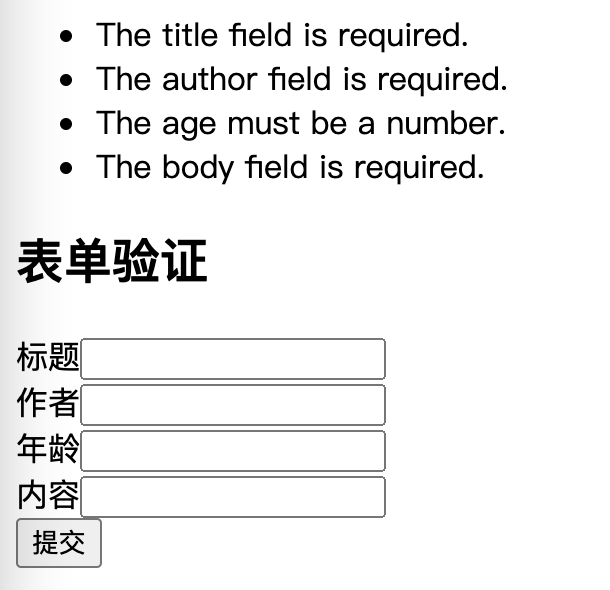

# 控制器与表单验证

在请求过程中，控制器往往是我们在做业务开发时绕不过的一环。从 MVC 理论的成熟到现代化的开发过程中，控制器一直扮演着重要的角色。可以说，我们可以不要前端（只做接口），可以不要模型（直接读取数据），但控制器却是必不可少的。当然，在正式的 MVC 模型中，视图是可以直接和模型交互的，由此，也引申出了 MVP 模型，其中的这个 P 就是强化控制器的作用，让模型和视图解耦。其实我们大部分正规的开发，都是基于这个 MVP 的，很少会直接让视图和模型去交互。

所以说，只要是遵循 MVC 模式的框架，控制器都是最核心的部分。在传统的框架中，我们的控制器往往也充当路由的功能，比如 TP3.2 系列，定义控制器名称就是我们要请求的 URL 路径名称。之前在讲路由的时候也说过这个问题，但是在 Laravel 中，实现了路由和控制器的解耦，所以我们的控制器是可以随意定义并且命名的，直接通过路由来进行绑定。

## 基础控制器

我们可以通过命令行来创建一个控制器，当然，您也可以直接自己创建一个控制器类。

```php
php artisan make:controller TestController
```

如果是自己创建的控制器类，需要继承 app/Http/Controllers/Controllers 这个基类。如果不继承这个基类，也就无法使用框架的能力，比如说中间件之类的功能。我们这里测试的是直接通过命令行创建的，看看它的代码。

```php
<?php

namespace App\Http\Controllers;

use Illuminate\Http\Request;

class TestController extends Controller
{
    //
}
```

非常简单，也没有什么别的特别的地方，接下来，我们就可以在这个控制器中写需要的控制方法了。

```php
public function test(){
}
```

最简单的一个控制器就这样实现了，接下来要如何访问它呢？当然就是去配下路由就好啦。

```php
Route::get('test/test', 'App\Http\Controllers\TestController@test');
// http://laravel8/test/test
```

这时访问的结果是一个空白的页面，因为在这个控制器方法中我们什么都没有做，也没有任何的返回，所以页面上没有任何的显示。但其实，Laravel 中还是为我们做了一些事情。比如返回 HTTP 的头信息，包括响应状态码、基础的头信息之类的内容。

另外，我们还可以定义一个单行为控制器，这是什么意思呢？其实就是一个控制器里面只有一个方法，这样的一个控制器就不需要在路由中指定控制方法。

```php

namespace App\Http\Controllers;

use Illuminate\Http\Request;

class Test2Controller extends Controller
{
    //
    public function __invoke()
    {
        echo 'single action controller';
    }
}
```

注意到单行为控制器中使用的这个 __invoke() 魔术方法了吗？不记得的小伙伴可以回到我们最早的文章中 [PHP的那些魔术方法（二）]() 复习一下，在 Laravel 中，我们会用到很多之前学习过的基础知识。所以说，框架的学习其实就是一次对于基础知识的全面巩固复习，同时也需要我们对于 PHP 的基础知识有牢固的掌握。

接下来就是路由和我们的测试了。

```php
Route::get('test/test2', 'App\Http\Controllers\Test2Controller');
// http://laravel8/test/test2
// single action controller
```

### 参数接收

对于请求参数的接收来说，在控制器中和在路由的回调函数中接收参数没有什么区别。都可以通过依赖注入的方式获取到指定的参数。

```php
// 控制器
public function test2(Request $request, $id){
    var_dump($request === \request()); // bool(true)
    return 'test2: ' . $id . ', ' . $request->input('name', '') . ', ' . \request()->input('sex', '');
}

// 路由
Route::get('test/test2/{id}', 'App\Http\Controllers\TestController@test2');
// http://laravel8/test/test2/2?name=Bob&sex=male
```

在这里，我们使用了两种接收 Request 的方式。一个是使用依赖注入的 request 对象，一个是使用 request() 方法返回的 Request 对象。两种方式在本质上没有什么区别，在代码中我们也打印了这两种方式的对象是否是全等的。只不过一个是通过依赖注入到当前方法的参数中，而另一个 request() 方法则是通过全局的服务容器来获取 Request 对象的。关于依赖注入和服务容器的内容都会在后面核心架构相关的文章中学习到。

## 资源型控制器

在上篇路由的文章中就讲过，我们可以定制一个资源型的路由，对应的就是一个资源型的控制器，这俩货是相辅相成的。那么什么是资源型呢？其实就是标准的 RESTful 类型的一套请求链接。对于 REST 有疑问的同学可以自行查阅相关的文档，在这里就不多说了，毕竟我们的主旨还是在于 Laravel 框架如何实现这些功能。

我们可以直接使用命令：

```php
php artisan make:controller ResourceTestController --resource
```

创建一个资源型的控制器，直接来看看代码，这个控制器已经为我们准备好了一系列的方法。

```php

namespace App\Http\Controllers;

use Illuminate\Http\Request;

class ResourceTestController extends Controller
{
    /**
     * Display a listing of the resource.
     *
     * @return \Illuminate\Http\Response
     */
    public function index()
    {
        //
        return 'get列表';
    }

    /**
     * Show the form for creating a new resource.
     *
     * @return \Illuminate\Http\Response
     */
    public function create()
    {
        //
        return 'post添加数据-显示表单';
    }

    /**
     * Store a newly created resource in storage.
     *
     * @param  \Illuminate\Http\Request  $request
     * @return \Illuminate\Http\Response
     */
    public function store(Request $request)
    {
        //
        return 'post保存数据';
    }

    /**
     * Display the specified resource.
     *
     * @param  int  $id
     * @return \Illuminate\Http\Response
     */
    public function show($id)
    {
        //
        return 'get单条数据';
    }

    /**
     * Show the form for editing the specified resource.
     *
     * @param  int  $id
     * @return \Illuminate\Http\Response
     */
    public function edit($id)
    {
        //
        return 'get修改数据-显示表单';
    }

    /**
     * Update the specified resource in storage.
     *
     * @param  \Illuminate\Http\Request  $request
     * @param  int  $id
     * @return \Illuminate\Http\Response
     */
    public function update(Request $request, $id)
    {
        //
        return 'put/patch修改数据';
    }

    /**
     * Remove the specified resource from storage.
     *
     * @param  int  $id
     * @return \Illuminate\Http\Response
     */
    public function destroy($id)
    {
        //
        return 'delete删除数据';
    }
}
```

当定义完成资源型控制器之后，就可以在路由上非常方便地配置这个资源的路由，一行就搞定。

```php
Route::resource('test/resource', 'App\Http\Controllers\ResourceTestController');
```

剩下的呢？Laravel 框架会自动帮我们配置以下这些路由，大家只要按照规则访问就好了。

|  请求方式   | 链接 | 说明 |
|  ----  | ----  | ---- |
|GET|/test/resource|索引/列表
|GET|/test/resource/create|创建（显示表单）
|POST|/test/resource/store|保存你创建的数据
|GET|/test/resource/{id}|显示对应id的内容
|GET|/test/resource/{id}/edit|编辑（显示表单）
|PUT/PATCH|/test/resource/{id}|保存你编辑的数据
|DELETE|/test/resource/{id}|删除

是不是感觉很高大上，确实如此，而且这一套路由也是非常符合 RESTFul 规范的，并且最主要的是，这一套路由不需要我们再手动去写了，它直接就帮我们定义好了。在测试的时候直接访问它们就可以了。

## 控制器的调用

对于路由到控制器的调用，还记得上篇文章中学习过的 laravel/framework/src/Illuminate/Routing/Route.php 这个文件中的 run() 方法吗？如果我们定义的路由是指定的控制器，那么它就会走到 runController() 。在这个 runController() 方法中，会指定分发到的控制器，其实也是从一个控制器的集合中查找指定的控制器信息。

```php
protected function runController()
{
    return $this->controllerDispatcher()->dispatch(
        $this, $this->getController(), $this->getControllerMethod()
    );
}
```

getController() 和 getControllerMethod() 都是获取的当前文件中的 action 里面的 uses 字段里面的内容，它保存的就是我们在路由中填写的控制器信息。

```php
$this->action->uses = "App\Http\Controllers\ResourceTestController@index";
```

在我们实例化所有路由时，都会创建一个 Route 对象。传递过来的数据就是我们在路由文件中定义的数据，也就是调 get()/post() 这些方法的时候添加的数据。而第二个参数，也就是我们指定的回调或者控制器参数就会充当 action 参数，交给 Route.php 中的 parseAction() 方法进行处理，处理之后的结果就会保存在当前这个 Route 对象的 action 属性里面。

整体来说，控制器的调用和回调路由的调用本质上是没有什么区别的。

## 快速表单验证

在日常的业务开发中，出于安全以及数据格式验证的考虑，我们通常会对接收到的参数进行验证过滤，一般情况下，都是通过一个个的 if...else 来进行这项工作。既然说到这里了，那么在 Laravel 框架中，其实也是有对应的表单验证的功能的，可以方便地让我们进行表单参数的验证。

首先我们需要定义一个页面，这个页面用于提交表单，只需要简单的定义一个模板页就可以。

```php
// ValidateController
public function create(){
    return view("validate.create");
}

// validate/create.blade.php
@if ($errors->any())
<div class="alert alert-danger">
    <ul>
        @foreach ($errors->all() as $error)
        <li>{{ $error }}</li>
        @endforeach
    </ul>
</div>
@endif

<h2>表单验证</h2>
<form method="post" action="http://laravel8/validate/store">
    <label>标题</label><input name="title"/><br/>
    <label>作者</label><input name="author"/><br/>
    <label>年龄</label><input name="age"/><br/>
    <label>内容</label><input name="body"/><br/>
    <input type="hidden" name="_token" value="{{ csrf_token() }}"/>
    <button type="submit">提交</button>
</form>

// route/web.php
Route::get('validate/create', 'App\Http\Controllers\ValidateController@create');
```

这个就相当于是一个要提交数据的静态表单页面，我们没有做别的任何操作。其中在模板文件中，csrf_token() 这个东西是用于 CSRF 攻击防御的，这个在后面如果学习到了相关的内容再说，大家也可以自行查阅一下相关的资料。如果没有这个 \_token 的话，那么表单提交之后就会报 419 的错误。

继续写我们的这个 store 接收页面。来看看我们如何验证这个表单里面提交的数据信息。

```php
// ValidateController
public function store(Request $request){
    $validatedData = $request->validate([
        'title'=>"required|max:20",
        'author'=>['required','min:2', 'max:20'],
        'age'=>"numeric",
        'body'=>"required"
    ]);
}

// route/web.php
Route::post('validate/store', 'App\Http\Controllers\ValidateController@store');
```

接下来就是去测试一下，在表单页面，我们什么都不填，直接提交，就可以看到页面上输出了如下的错误提示信息。



这个错误信息正是在模板中的

```php
@if ($errors->any())
<div class="alert alert-danger">
    <ul>
        @foreach ($errors->all() as $error)
        <li>{{ $error }}</li>
        @endforeach
    </ul>
</div>
@endif
```

这段代码输出的。而验证的规则，则是在 request 的 validate() 方法中配置的这些。从英文可以看出，我们让 title 这个字段 required（必填）、max:20（最大不超过20个），让 age 这个字段的内容 numeric（只能是数字）。当然，还有很多可配置的内容，在这里就不一一列举了，大家可以自己查阅相关的文档，毕竟这些东西都是文档中现成的，学习这些配置参数的使用也不是我们这个系列文章的重点。

从这段功能的测试代码中，我们可以看出几个问题。其一，这个验证是直接通过请求对象实现的，也就是这个 Request 对象中的方法，而且我们在控制器中没有返回 Response ，也就是说，这一切框架都自动为我们处理了。其二，错误信息会直接传到模板的一个 $errors 变量中，这个也不是我们控制的，也是框架自动处理的，这个地方也是我们平常在写业务代码的时候需要注意的，因为这个变量名是写死在框架内部的，不能修改的。其三，没有地方设置错误信息的内容，比如说我们要显示中文的错误信息。

太智能太自动的东西有好处，但也有很多的限制，比如这个第三点，如果需要显示中文的错误信息的话，我们需要去下载或者自己配置一个 resource/lang 下的语言包，并且修改框架配置中的 lang 为对应的语言包。不过，我们有别的办法来解决，那就是我们自己配置，手动验证。

### 手动验证

说实话，上面的自动表单验证平常还真没用过。平常用得最多的反而是这个自定义的手动验证，说是手动验证，其实大部分也是已经框架提供好的内容，我们只需要简单的配置就可以了。

```php
public function store2(Request $request){
    $validator = Validator::make($request->all(), [
        'title'=>"required|max:20",
        'author'=>['required','min:2', 'max:20'],
        'age'=>"numeric",
        'body'=>"required"
    ], [
        'title.required'=>'请填写标题',
        'title.max'=>'标题最大不超过20个字符',
        'author.required'=>'请填写作者',
        'author.min'=>'作者最少填写2个字符',
        'author.max'=>'作者最大不超过20个字符',
        'age.numeric'=>'年龄必须是数字',
        'body.required'=>'内容必填'
    ]);

    if($validator->fails()){
        return redirect('validate/create')
            ->withErrors($validator)
            ->withInput();
    }
}
```

在这个控制器中，我们使用的是 Validator 这个门面类 make() 出来的一个验证器。它的第一个参数我们传递的是所有的请求数据，当然，也可以自己传递一个数组进来进行验证。第二个参数就是和上面一样的验证配置信息。不同的，它的第三个参数是我们可以自定义的验证提示信息。有了这个参数，返回的提示需要什么样的内容就方便了很多。

最后，还有一处不同的是，这个 Validator 对象不是用得请求 Request 的方法，所以它不会自动返回，需要自己构造 Response ，在这里，我们跳转回了原来的页面，并且将错误信息通过 withErrors() 添加到了模板的 $errors 变量中。进入 withError() 方法，我们可以看到 $errors 是保存在 session 的 flash() 中，这个我们后面讲 session 的时候再说。

```php
// laravel/framework/src/Illuminate/Http/RedirectResponse.php
public function withErrors($provider, $key = 'default')
{
    $value = $this->parseErrors($provider);

    $errors = $this->session->get('errors', new ViewErrorBag);

    if (! $errors instanceof ViewErrorBag) {
        $errors = new ViewErrorBag;
    }

    $this->session->flash(
        'errors', $errors->put($key, $value)
    );

    return $this;
}
```

## 数据验证的源码处理

不管是请求对象的验证函数，还是我们通过门面 make() 后获得的验证对象，它的核心都是 laravel/framework/src/Illuminate/Validation/Validator.php 这个文件中的 Validator 对象。在初始化的时候，会将数据 data 、 规则 initialRules 、提示消息 customMessages 存放到这个对象的相关变量中，然后通过对象里面的 validateAttribute() 方法进行参数和规则的匹配，并通过 addFailure() 方法匹配对应的提示消息信息，最后将这些信息放在 messages 属性中。上面 withErrors() 的代码中的 parseErrors() 最终的调用其实就是走到了 Validator 对象的 validateAttribute() 这个方法中。

基本上整个处理过程都是在这个 Validator 对象里面，所以这里我也就不贴代码了，大家自己调试一下。

## 总结

这篇文章的内容不少吧，我们学习了控制器和验证器相关的内容，之所以把这两个放在一起，也是因为验证这个功能一般都会在控制器的最开始使用。当然，我们在讲数据库模型的时候，还有数据库验证相关的内容，和这边又不太一样了，这个我们等学习到的时候再说。

控制器的内容其实并不多，但里面的很多东西我们并没有都讲解到，毕竟现成的文档都在，也没必要全部再复制一遍，还是以调用路径的源码分析分主。下一个要讲的内容相信也是很多同学非常感兴趣的，那就是中间件的应用以及源码的分析。

测试代码：

参考文档：

[https://learnku.com/docs/laravel/8.x/controllers/9368](https://learnku.com/docs/laravel/8.x/controllers/9368)

[https://learnku.com/docs/laravel/8.x/validation/937](https://learnku.com/docs/laravel/8.x/validation/9374)