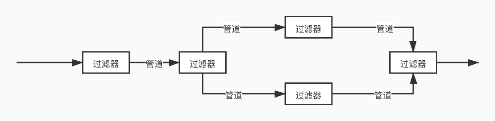

# 管道过滤器

通过之前的三篇文章，我们已经学习完了服务容器相关的内容，可以说，服务容器就是整个 Laravel 框架的灵魂，从启动的第一步开始就是创建容器并且加载所有的服务对象。而说起管道，其实大家也不会太陌生，在程序开发的世界中，管道模式的应用随处可见，同样在 Laravel 框架中，它也是核心一般的存在。甚至可以说，管道和服务容器的组合，才让我们有了一个这样的框架可以使用。

## 什么是管道

前面说过，管道模式非常常见，为什么这么说呢？

```php
ps -ef | grep php
```

常见不？经常用吧？这个 Linux 命令就是一个管道命令。前面一条命令的结果交给后面一条命令来执行，就像一条管道一样让这个命令请求的结果向下流动，这就是管道模式的应用。

除了这个你还能想到什么呢？如果你跟过我的 PHP 设计模式系列的话，那么 责任链模式 很明显就是管道模式在 面向对象 语言中的应用呀。



管道模式一般是和过滤器一起使用的，什么是过滤器呢？其实就是我们要处理请求的那些中间方法，比如说上面命令中的 grep ，或者是 wc 、awk 这些的命令。大家其实很快就能发现，在 Laravel 框架中，我们的中间件就是一个个的过滤器。而我们要处理的数据，就是那个 Request 请求对象。

## Laravel 中管道的加载应用

还记得我们在服务容器中看到过的一个 sendRequestThroughRouter() 方法吗？另外在最早讲中间件时，我们也讲过这里，我们再来看看它的代码。

```php
protected function sendRequestThroughRouter($request)
{
    $this->app->instance('request', $request);

    Facade::clearResolvedInstance('request');

    $this->bootstrap();

    return (new Pipeline($this->app))
                ->send($request)
                ->through($this->app->shouldSkipMiddleware() ? [] : $this->middleware)
                ->then($this->dispatchToRouter());
}
```

在这段代码中，最后返回的那个 Pipeline 对象就是一个管道对象。我们来看看它的这几个方法是什么意思。

```php
public function __construct(Container $container = null)
{
    $this->container = $container;
}

public function send($passable)
{
    $this->passable = $passable;

    return $this;
}

public function through($pipes)
{
    $this->pipes = is_array($pipes) ? $pipes : func_get_args();

    return $this;
}
```

构造函数、send() 和 through() 方法都比较简单，就是给当前的对象中的属性赋值，这个没什么特别的。不过在 Pipeline 对象中，所有的方法都是会 return 一个 $this ，其实也就是实现了对象的链式调用。

重点在于 then() 方法。

```php
public function then(Closure $destination)
{
    $pipeline = array_reduce(
        array_reverse($this->pipes()), $this->carry(), $this->prepareDestination($destination)
    );

    return $pipeline($this->passable);
}
```

这个方法也出乎意料的简单吧？里面只用了一个 array_reduce() ，OK，到这里，你就可以和面试官吹牛了，Laravel 中的管道，或者说中间件，其实最核心的就是这个 array_reduce() 方法。要搞清楚 then() 方法是在干什么，我们就要先搞明白 array_reduce() 是在干嘛。

### array_reduce

array_reduce() 这个函数在官方文档的签名是这样的：

```php
array_reduce(array $array, callable $callback, mixed $initial = null): mixed
```

它的作用是将回调函数 callback 迭代地作用到 array 数组中的每一个单元中，从而将数组简化为单一的值。如果指定了可选参数 initial，该参数将用作处理开始时的初始值，如果数组为空，则会作为最终结果返回。

callback 这个回调函数会有两个参数，分别是 carry 携带上次迭代的返回值，如果迭代是第一次，那么这个值就是 initial 。另一个参数是 item ，也就是数组中的每个值。

看不懂吧？正常，我也看不懂，别慌，看例子。

```php
function sum($carry, $item)
{
    $carry += $item;
    return $carry;
}

function product($carry, $item)
{
    $carry *= $item;
    return $carry;
}

$a = array(1, 2, 3, 4, 5);
$x = array();

var_dump(array_reduce($a, "sum")); // int(15)
var_dump(array_reduce($a, "product", 10)); // int(1200), because: 10*1*2*3*4*5
var_dump(array_reduce($x, "sum", "No data to reduce")); // string(17) "No data to reduce"
```

这段代码是官网上的例子。我们定义了一个 sum() 方法用于累加，另外再定义了一个 product() 方法用于阶乘。前两段测试的结果可以看出，通过将第一个数组传递进去，然后调用 sum() 方法，我们完成了累加的功能，输出了一个唯一的结果值。第二段则是增加了第三个参数给了个默认的 10 ，结果就是多乘了一个 10 的累乘结果。而最后一段则是一个空的数组，返回的是 initial 给定的结果。

### 框架中 array_reduce 的参数

搞清楚了 array_reduce() 我们再回来看看框架源码中给出的参数。第一个参数是使用 array_reverse() 返回之后的 pipes 里面的内容，这个 pipes 是我们通过 through() 方法传递进来的。再回到 Kernel 中，我们会发现这个方法传递进去的参数正是我们框架中加载的中间件 $middleware 成员变量。

之前的 bootstrap() 过程中，我们已经将所有的 app/Http/Kernel.php 中注册的中间件绑定注册到了服务容器中。因此，这个 pipes 数组中，就是我们所有的中间件信息。

接下来第二个参数是调用的一个 carry() 函数，它在 array_reduce() 方法中代表的是 callback 那个回调函数。

```php
protected function carry()
{
    return function ($stack, $pipe) {
        return function ($passable) use ($stack, $pipe) {
            try {
                if (is_callable($pipe)) {
                    return $pipe($passable, $stack);
                } elseif (! is_object($pipe)) {
                    [$name, $parameters] = $this->parsePipeString($pipe);

                    $pipe = $this->getContainer()->make($name);

                    $parameters = array_merge([$passable, $stack], $parameters);
                } else {
                    $parameters = [$passable, $stack];
                }

                $carry = method_exists($pipe, $this->method)
                                ? $pipe->{$this->method}(...$parameters)
                                : $pipe(...$parameters);

                return $this->handleCarry($carry);
            } catch (Throwable $e) {
                return $this->handleException($passable, $e);
            }
        };
    };
}
```

这个方法就复杂许多了。我们一步步的来看。

参数不用多说了吧，stack 是上一次的返回值，pipe 是当前我们要处理的值，也就是当前的中间件对象。在这个回调函数中又调用了一层回调函数，并将这两个值通过 use 传递进去。而在里面的这个回调函数中，我们的参数是 passable 这个变量。这个 passable 又是哪里来的？别急，我们先看这个函数内部的实现，最后会再说到 passable 这个问题。

进入函数内部的 try 代码段中，第一个判断，如果 pipe 是一个回调函数，直接调用它并返回；第二个判断，如果 pipe 不是一个对象而是一个 string 的话，解构 pipe 信息，服务容器 make 它，并且准备好参数；最后一个 else 也就是 pipe 是一个对象，那么将 passable 和 stack 作为它的参数。最后，如果对象都有了，就会统一调用对象的 handle 方法，这个方法名也就是 $this->method 属性定义的方法名。在最底下 $carry 调用对象或者回调函数的执行方法。handle 熟悉不？我们自定义中间件时，要实现的就是这个方法。参考：**【Laravel系列3.4】中间件在路由与控制器中的应用** [https://mp.weixin.qq.com/s/9340q7F_hKrrxgf4o1LNMw](https://mp.weixin.qq.com/s/9340q7F_hKrrxgf4o1LNMw)。

最终返回的就是这个 $carry 变量，它是啥？中间件中 return next() 的东西呀，管道中的下一个回调函数。

上面的代码我们是嵌套了两层的回调函数，通过之间的学习，我们知道回调函数是有延迟加载的特性的，也就说，这一堆代码是在我们最终调用这个回调函数的时候才会触发的，那么它是在什么时候调用的呢？

```php
public function then(Closure $destination)
{
    $pipeline = array_reduce(
        array_reverse($this->pipes()), $this->carry(), $this->prepareDestination($destination)
    );

    return $pipeline($this->passable);
}
```

没错，then() 方法最后的这个 return 这里，现在知道 passable 是从哪里传递进去的了吧。注意，这个 passable 和最后那个默认 initial 参数，都是我们当前的请求 Request 对象和路由 Route 对象。也就是说，在整个 Laravel 框架中，我们管道中流动的，正是我们的 Request 对象，而最后返回的，则是各个中间件以及控制器处理完成之后的 Response 对象。中间件、控制器甚至路由，其实都是我们管道中的一个个的过滤器，根据我们的条件情况以及业务情况，可以随时中断或者对请求进行处理，这下也就理解了什么我们可以在中间件返回，也可以在路由直接返回页面结果了吧。

好吧，学习一个管道，其实我们又把整个请求响应流程梳理了一遍。收获满满吧！

## 直接写一个管道应用来测试

直接调试管道可能比较复杂，因为 Laravel 框架加载的内容非常多，不过我们可以自己写一个管道应用来测试，并且可以设置断点来方便地调试。

首先，我们需要定义几个过滤器，也就是我们的中间件啦，不过我们不需要去实现 Laravel 规范的，只需要有 handle() 方法就可以了。

```php
class AddDollar
{
    public function handle($text, $next){
        return $next("$".$text."$");
    }
}

class AddTime
{
    public function handle($text, $next){
        $t = $next($text);
        return $t . time();
    }
}

class EmailChange
{
    public function handle($text, $next){
        return $next(str_replace("@", "#", $text));
    }
}
```

没有什么特殊的功能，我们过滤掉 Email 中的 @ 符号变成 # 号，这个很多网站有会这样的功能，避免被爬取 Email 地址。另外两个就是增加符号和时间戳。在 AddTime 的处理中，我们使用的是 后置 中间件的功能，也就是在中间件完成处理后再添加内容。这个在中间件相关的课程中我们也已经讲过了。

接下来，就是使用管道来进行处理。

```php
Route::get('pipeline/test1', function(){
    $pipes = [
        \App\PipelineTest\EmailChange::class,
        \App\PipelineTest\AddTime::class,
        new \App\PipelineTest\AddDollar(),
        function($text, $next){
            return $next("【".$text."】");
        },
    ];

    return app(\Illuminate\Pipeline\Pipeline::class)
        ->send("测试内容看看替换Email:zyblog@zyblog.ddd")
        ->through($pipes)
        ->then(function ($text) {
            return $text . "end";
        });
    // $【测试内容看看替换Email:zyblog#zyblog.ddd】$end1630978948

});
```

在这段测试代码中，我们对 pipes 数组使用了类字符串、实例对象、回调函数三种方式来实现中间件过滤器，可以看到最后的输出结果正是我们想要的内容。

大家可以在这里设置断点然后进入到 Pipeline 中查看这些中间件是如何调用运行的，为什么要使用 array_reverse() 反转中间件的顺序，为什么后置中间件会在最后才去添加数据内容。这一块的调试就留给大家自己来吧！

## 总结

服务容器、管道（中间件）可以说是 Laravel 框架中最最核心的内容，也可以说整个框架就是建立在这两个模式之下的。对于服务容器的理解，就是要解决类的依赖问题，而对于管道的理解，则是要解决请求和响应的数据流问题。本身我们做 Web 开发，实际上就是在做对请求和响应这两条数据流的各种操作而已。

理解了最核心的两部分内容之后，下篇文章的课程中我们再来看看在 Laravel 中非常常用的 门面 功能是怎样实现的。

参考文档：

Laravel 中的 Pipeline — 管道设计范式
：[https://learnku.com/laravel/t/7543/pipeline-pipeline-design-paradigm-in-laravel](https://learnku.com/laravel/t/7543/pipeline-pipeline-design-paradigm-in-laravel)

Laravel 管道流原理
：[https://learnku.com/articles/5206/the-use-of-php-built-in-function-array-reduce-in-laravel](https://learnku.com/articles/5206/the-use-of-php-built-in-function-array-reduce-in-laravel)