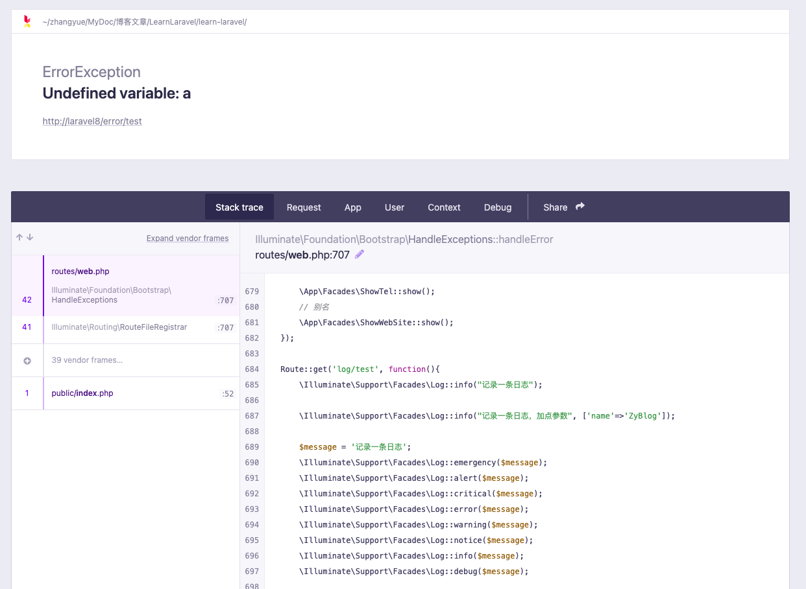
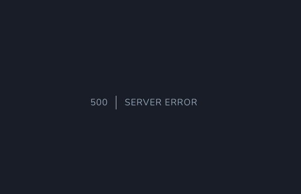

# 错误与异常处理

在学习完 Laravel 中的日志处理模块之后，接下来马上就进入到错误和异常的学习中。其实通过之前 PHP 基础相关的学习，我们已经了解到 PHP7 中的大部分错误都已经可以通过异常来进行处理了，而我们的 Laravel 框架，基本全是通过异常来进行处理的。

如果没有看过之前的文章或者视频，可以回去再看一下，链接在文章底部，因为关于错误和异常有三篇文章。

## 产生错误异常信息

首先我们要来模拟产生一个异常的错误信息。其实很简单，去写一个未定义的变量就好了。

```php
Route::get('error/test', function(){
    echo $a;
});
```

这时候直接访问当前这个路由的话，在默认情况下就会显示错误信息。比如下面这样的。



在这个页面中，我们可以看到的是报出的错误信息详情，以及下面的调用堆栈信息。这种报错页面非常便于我们调试错误，同时，这些错误信息也会同步记录到你的日志文件中，大家可以看看自己的日志里面是不是已经记录了错误信息。

这样的错误页面对我们的开发调试很友好，但是在线上可是不能直接暴露的，毕竟你的文件路径都暴露出来了，这是非常危险的。所以，在正式的线上环境中，我们会修改 .env 文件中的 APP_DEBUG 为 false 。这样的话，我们的详细错误信息就不会显示出来了，只会显示一个错误页面。



很明显，对于错误信息的显示就是通过 .env 中的 APP_DEBUG 来控制的，你也可以直接去修改 config/app.php 配置文件中的 debug 配置来指定调试值。

```php
'debug' => (bool)env('APP_DEBUG', false),
```

## 报告异常

在框架中，我们所有的异常都是通过 app/Exceptions/Handler.php 这个类来进行处理的。在这个文件中，有一个 register() 方法，它可以注册自定义的异常报告程序和渲染回调，默认情况下，也会将异常信息写到日志中。

```php
public function register()
{
    $this->reportable(function (Throwable $e) {
        //
    });
}
```

在之前的基础学习中，我们知道 Throwable 是现在 PHP 中所有异常和错误的基础接口，所有的问题都可以通过这个 Throwable 来进行捕获。如果只是异常的话，它们的基类可以用 Exception 来进行捕获，如果只是错误的话，可以通过 ErrorException 来进行捕获，而 Throwable 是所有信息都可以用它来捕获。

默认情况下这个闭包方法中没有任何操作，那么我们不管它，让它继续走默认的处理，我们自己定义一个捕获特定错误进行处理的方法。

```php
public function register()
{
    $this->reportable(function (ErrorException $e){
        Log::channel('custom')->error($e->getMessage());
    })->stop();

    $this->reportable(function (Throwable $e) {
        //
    });
}
```

在上面的例子中，定义了一个用于捕获 ErrorException 的处理方法，在这个回调函数内部将日志写入到上节课中定义的 custom 日志配置中。然后再次运行路由进行测试，你会发现日志被记录到了 storage/logs/zyblog.log 文件中，而 laravel.log 文件中没有记录。其实在默认情况下，所有的错误信息都会在 laravel.log 或者你定义的那个默认的日志配置中进行记录，但在这里，我们给 ErrorException 的错误处理的 reportable() 方法再继续调用了一个 stop() 方法。它的作用就是中止后续的默认日志的记录。

怎么测试呢？你可以手动去抛出一个普通异常。

```php
Route::get('error/test', function(){
    throw new Exception('test');
    echo $a;
});
```

然后查看对应的日志文件，就会发现这个 test 的手动抛出的异常只会在 laravel.log 中记录，而 zyblog.log 中不会有记录。

从这里，其实你也可以看出 reportable() 方法就是用于报告异常情况的，它的回调函数中除了日志记录之外，还有一个最大的用处是可以让我们把异常发送到外部，比如说钉钉、企业微信或者电子邮箱等等。如果你没有这方面的需求，其实这里不太需要变动，直接让他们记录日志就好了。

## 渲染异常

产生了异常之后，我们肯定要有一个显示异常的响应返回回来。对于 Laravel 来说，默认情况下根据不同的 APP_DEBUG 的配置，就可以得到上面两个截图中的不同的响应返回页面。这是默认情况下框架为我们提供的页面，那么我们能不能自定义异常的返回页面或者返回信息呢？当然没有问题。

```php
$this->renderable(function (Throwable $e, $request){
    if($request->ajax()){
        return response()->json(['code'=>$e->getCode(), 'msg'=>$e->getMessage()]);
    }else{
        return response()->view('errors.custom', ['msg'=>$e->getMessage()], 500);
    }
});
```

同样还是在 register() 方法中，不过这次我们使用的是 renderable() 这个方法。它的回调函数有两个参数，第一个是异常对象，第二个是请求信息。通过这个请求信息，我们就可以构造不同的响应返回页面。比如说在这里我通过判断请求是否是 ajax 请求来返回不同的响应的内容，如果是 ajax 请求，那么就返回 json 格式的错误信息。如果不是的话，就返回一个我自己定义的错误页面。这个页面非常简单，直接在 resources/views/errors 目录下创建了一个 custom.blade.php 模板文件。

```php
<!DOCTYPE html>
<html lang="en">
    <head>
        <meta charset="UTF-8">
        <title>发生错误啦</title>
    </head>
    <body>
        发生错误啦!!!!
        {{$msg}}
    </body>
</html>
```

聪明的你一定想到了，对于我们很多的业务开发来说，前后端分离已经是现行的标准规范，只要是 ajax 请求，默认的响应处理器就会返回 json 格式的错误信息。但是这个错误信息的格式可能并不是和你系统中定义的格式是相同的。这时候，就可以通过自定义 renderable() 方法中的错误返回格式来实现全部数据接口的格式统一。另外，自定义错误页面也是一个网站吸引人的地方，比如说很多网站的 404 页面就设计的很有意思，在这里，也是可以通过 renderable() 来实现个性化的错误页面展示的。

## report()辅助函数

假设我们把异常给 try...catch 掉了，那么我们还会记录到日志吗？大家可以试试，这个时候日志中是不会有记录的。但如果我们也想要 try...catch 的时候产生的错误信息也记到到日志文件中，那么我们就可以使用一个 report() 辅助函数。

```php
try {
    throw new Exception('test');
    echo $a;
} catch (Exception $e) {
    report($e);
}
```

这个时候你就会发现日志被记录到了对应的日志文件中，同时，还有一个现象你发现没有？那就是使用 report() 函数，程序不会中断执行，依然是正常的执行。

```php
// vendor/laravel/framework/src/Illuminate/Foundation/helpers.php
if (! function_exists('report')) {
    function report($exception)
    {
        if (is_string($exception)) {
            $exception = new Exception($exception);
        }

        app(ExceptionHandler::class)->report($exception);
    }
}
```

通过 report() 方法的源码，你会发现它只是调用了错误控制类的 report() 方法，在这里是使用容器获得的错误处理对象，实际上的对象是 vendor/laravel/framework/src/Illuminate/Foundation/Exceptions/Handler.php 。

```php
public function report(Throwable $e)
{
    $e = $this->mapException($e);

    if ($this->shouldntReport($e)) {
        return;
    }

    if (Reflector::isCallable($reportCallable = [$e, 'report'])) {
        if ($this->container->call($reportCallable) !== false) {
            return;
        }
    }

    foreach ($this->reportCallbacks as $reportCallback) {
        if ($reportCallback->handles($e)) {
            if ($reportCallback($e) === false) {
                return;
            }
        }
    }

    try {
        $logger = $this->container->make(LoggerInterface::class);
    } catch (Exception $ex) {
        throw $e;
    }

    $logger->error(
        $e->getMessage(),
        array_merge(
            $this->exceptionContext($e),
            $this->context(),
            ['exception' => $e]
        )
    );
}
```

可以看到这个 report() 方法的实现就只是通过日志去进行记录了，没有别的什么操作，所以它当然不会中断程序的执行啦。

## 自定义异常类

自定义普通的异常没有什么好说的，继承指定的异常对象就行了，比如说 Exception、ErrorException、Throwable 之类的都可以。有趣的是在 Laravel 框架中，我们可以在自定义的异常类中定义好 report() 和 render() 方法，这样，如果抛出的是我们自定义的异常，那么它们就会直接走这个异常类中对应的 report() 和 render() 方法，就和在全局的 Handle 对象中的 register() 里面定义的 reportable() 和 renderable() 一样。

```php
// app/Exceptions/ZyBlogException.php
class ZyBlogException extends \Exception
{
    public function report()
    {
        Log::channel('custom')->error($this->getMessage());
    }

    public function render($request)
    {
        return "异常错误内容为：" . $this->getMessage();
    }
}

// routes/web.php
Route::get('error/test', function(){
    throw new \App\Exceptions\ZyBlogException('又有问题了');
});
```

这样的自定义异常类是不是非常方便使用呢？

## HTTP异常

HTTP 异常主要的体现其实就是我们返回的 HTTP 状态码，比如说 404 找不到页面，401 未授权，500 错误，502 服务不可用之类的。除了系统自己报出的这类错误之外，我们也可以手动抛出，这里就可以使用一个 abort() 辅助函数。

```php
abort(404, '没有找到页面哦');
```

在测试的时候我们要把上面在 register() 中写的 renderable() 给注释掉，因为我们捕获了全局的 Exception 并进行响应返回，如果不注释掉就会以我们自定义的 rederable() 的内容进行输出，这样我们就看不出效果了。或者我们可以判断一下传递进来的 Exception 对象是不是 Symfony\Component\HttpKernel\Exception\HttpException 对象，如果是的话就不处理，走框架默认的。

```php
$this->renderable(function (\Exception $e, $request){
    if($request->ajax()){
        return response()->json(['code'=>$e->getCode(), 'msg'=>$e->getMessage()]);
    }else{
        if(!($e instanceof HttpException)){
            return response()->view('errors.custom', ['msg'=>$e->getMessage()], 500);
        }
    }
});
```

正常默认情况下报错的页面和上面我们截图的那个 500 错误页面非常类似，只是内容变成了 404 | NOT FOUND ，并且 http_code 也变成了 404 。如果想要自定义一个错误页面，可以直接在 resource/views/errors 中定义一个 404.blade.php 文件。

```php
<!DOCTYPE html>
<html lang="en">
    <head>
        <meta charset="UTF-8">
        <title>这是404页面</title>
    </head>
    <body>
        这是404页面
        {{ $exception->getMessage() }}
    </body>
</html>
```

这个页面中的错误信息会通过 \$exception 直接带进来，同样地，我们还可以在这里直接定义好 403、500 之类的错误页面。这里的页面模板命名是固定的，如果需要自定义文件名的话，那么就还是要使用我们的 renderable() 来操作了。

## 异常处理过程

其实对于 PHP 的异常处理过程我们在之前的文章，也就是前面说过的文末的那三条链接中的内容都已经详细地学习过了。现在主要的疑问是在于 Laravel 框架中是如何去捕获这些全局的异常和错误信息的，是使用我们熟悉的 set_error_handler()、set_exception_handler() 这些函数吗？带着这个问题，我们就来剖析一下 Laravel 源码是如何处理这些情况的。

在之前讲过的 
**【Laravel系列6.3】框架启动与服务容器源码**
[https://mp.weixin.qq.com/s/gavAityVdFU4BgLVf_KCDA](https://mp.weixin.qq.com/s/gavAityVdFU4BgLVf_KCDA) 
中，vendor/laravel/framework/src/Illuminate/Foundation/Http/Kernel.php 的启动加载数组里面就有一个 vendor/laravel/framework/src/Illuminate/Foundation/Bootstrap/HandleExceptions.php 服务提供者。这玩意其实从名字就能看出来，控制异常情况的服务提供者嘛。话不多说，直接进去看看吧。

```php
public function bootstrap(Application $app)
{
    self::$reservedMemory = str_repeat('x', 10240);

    $this->app = $app;

    error_reporting(-1);

    set_error_handler([$this, 'handleError']);

    set_exception_handler([$this, 'handleException']);

    register_shutdown_function([$this, 'handleShutdown']);

    if (! $app->environment('testing')) {
        ini_set('display_errors', 'Off');
    }
}
```

熟悉的配方，熟悉的味道，还需要我再多说什么吗？接下来就是看看异常和错误处理所定义的全局处理函数了。我们从错误处理看看起，同样在当前这个文件中的 handleError() 方法。

```php
public function handleError($level, $message, $file = '', $line = 0, $context = [])
{
    if (error_reporting() & $level) {
        throw new ErrorException($message, 0, $level, $file, $line);
    }
}
```

它会将错误信息转换成 ErrorException 再次进行抛出，这次抛出后就进入了异常的处理流程，错误这一块就没什么多说的了。

```php
public function handleException(Throwable $e)
{
    try {
        self::$reservedMemory = null;

        $this->getExceptionHandler()->report($e);
    } catch (Exception $e) {
        //
    }

    if ($this->app->runningInConsole()) {
        $this->renderForConsole($e);
    } else {
        $this->renderHttpResponse($e);
    }
}

protected function getExceptionHandler()
{
    return $this->app->make(ExceptionHandler::class);
}

protected function renderHttpResponse(Throwable $e)
{
    $this->getExceptionHandler()->render($this->app['request'], $e)->send();
}
```

在异常处理中，我们可以看到它会调用 getExceptionHandler() 方法获取异常处理实例，这个实例是通过服务容器加载的，它就是我们上面学习过的那个 app/Exceptions/Handler.php 对象的实例。通过这个实例及其父类的 report() 方法报告异常，记录日志，然后通过 render() 方法返回输出错误结果到响应流中，一套异常处理过程就这样走完了。

简单不？惊喜不？就是这么 easy ，这系列到现在为止最简单的源码分析了吧。不过内部的处理其实还更为复杂一些，app/Exceptions/Handler.php 所继承的 vendor/laravel/framework/src/Illuminate/Foundation/Exceptions/Handler.php 类中的 report() 和 render() 方法的实现才是更重要的内容，大家可以自己再深入的分析一下，比如说 reportable() 和 renderable() 是怎么在 report() 和 render() 中起作用的，总体来说都还是比较简单的。

## 总结

上篇学习完日志，这篇学习完异常和错误处理，整个调试诊断方面的内容也就完成了，这也是每个框架中最重要的内容，不仅限于 Laravel 框架。现在大部分的框架的处理方式也都是类似的，将错误集中到一起进行记录以及报出。其实到这里相信大家对于框架的源码已经非常熟悉了，后面的内容在源码分析这一块我们也不会太深入的学习，更多的会以应用为主，毕竟这些附加功能本身就都是集成于整个服务容器和管道应用中的。

参考文档：

[https://learnku.com/docs/laravel/8.x/errors/9375](https://learnku.com/docs/laravel/8.x/errors/9375)

一起搞懂PHP的错误和异常（一）[https://mp.weixin.qq.com/s/OhM1MHsAJQpJKQHu7cGyig](https://mp.weixin.qq.com/s/OhM1MHsAJQpJKQHu7cGyig)

一起搞懂PHP的错误和异常（二）[https://mp.weixin.qq.com/s/71i_EAtDX00INJF7_cwLZA](https://mp.weixin.qq.com/s/71i_EAtDX00INJF7_cwLZA)

一起搞懂PHP的错误和异常（三）[https://mp.weixin.qq.com/s/bJzbz5On_LL_UX2HoVjcVQ](https://mp.weixin.qq.com/s/bJzbz5On_LL_UX2HoVjcVQ)