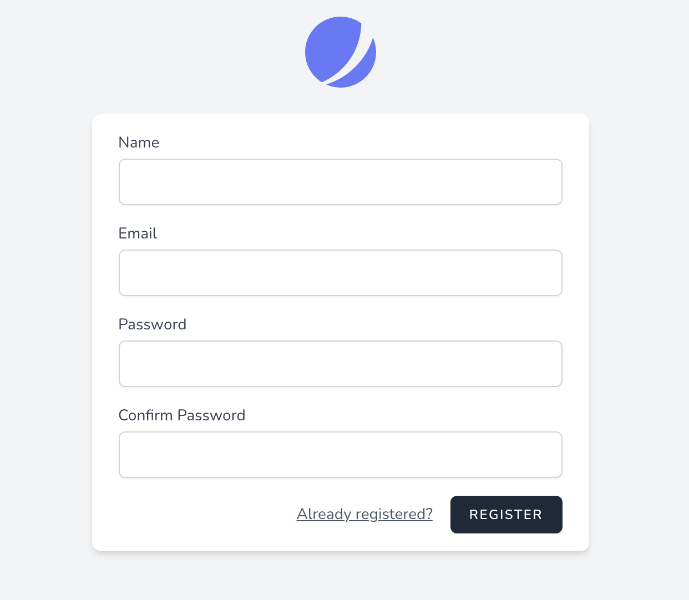

# 安全相关

对于一个框架来说，安全体系是非常重要的一环。如果一个框架没有好的安全措施及功能的话，那么这个框架在线上运行的时候多多少少还是会让人不放心的，毕竟各路大佬可能随时都在扫描各个网站的漏洞。之前的各种安全事件可能你不一定经历过，但一定听说过。今天，我们就来看看 Laravel 中的安全相关功能。

## 认证体系

在 Laravel 中，自带了一套用户登录认证体系，这一套体系原来是直接框架自带的，现在剥离出来通过 laravel/jetstream 组件实现了。默认情况下，我们安装 Laravel 框架后，会自带一个默认的 User Model ，这个 Model 就是这个默认用户表的模型类。

```php
composer require laravel/jetstream

// 使用 Livewire 栈安装 Jetstream...
php artisan jetstream:install livewire

// 使用 Inertia 栈安装 Jetstream...
php artisan jetstream:install inertia

composer require laravel/sanctum

npm install && npm run dev
```

通过这三个命令行代码，我们就可以安装好 Jetstream 相关的组件，安装完成后，将会自带路由以及 view 界面，我们可以访问 /register 路径，返回的界面是这个样子的。



这就是系统为我们生成的界面，这个时候如果我们查看 route/web.php 的话，是看不到任何路由信息的，那么它的路由是在哪里定义的呢？其实它是通过 /vendor/laravel/fortify/src/FortifyServiceProvider.php 中的 configureRoutes() 方法添加的，这个服务提供者是 vendor/laravel/framework/src/Illuminate/Foundation/Application.php 容器类在 registerConfiguredProviders() 中加载的。最后实际加载的是 vendor/laravel/fortify/routes/routes.php 这个路由文件。

```php
// ……
if (Features::enabled(Features::registration())) {
    if ($enableViews) {
        Route::get('/register', [RegisteredUserController::class, 'create'])
            ->middleware(['guest:'.config('fortify.guard')])
            ->name('register');
    }

    Route::post('/register', [RegisteredUserController::class, 'store'])
        ->middleware(['guest:'.config('fortify.guard')]);
}
// ……
```

在这个文件中，我们还可以看到 login、logout、user 相关的操作路由。那么它的模板在哪里呢？其实上面的 npm run dev 操作就是编译了 Laravel 框架自带的 Vue 框架，而模板走的正是 Vue ，文件在 resource/js/Pages 中，在这里我们可以找到 Auth/Register.vue 这个文件，随便修改一点然后再次执行 npm run dev 重新编译，就可以看到修改之后的内容了。或许还有别的方法，可以走普通的直接输出的页面形式，因为 view/auth 下面也生成了一些文件，一开始我还以为是走的这里的前端文件，但结果并不是。我们也不深究了。

费劲吗？其实挺费劲的，如果是正式的公司团队开发的话，前端小哥哥小姐姐们才不会来你的 Laravel 框架中进行编译或者写代码呢。所以这个功能更适合的是我们自己一个人承担一整套后台页面开发的情况。说白了，做私活的时候很方便。

不过，更多情况下其实我们还是宁愿自己使用 vue 脚手架去让前后端完全分离，所以这一块的功能，大家了解一下就好。接下来我们看看怎么自己实现这些注册登录操作，以接口形式。（网页形式也是同理的）

### 自已实现的注册、登录

要自己实现登录注册其实非常简单，如果只是网页的登录，同样我们还是使用 Laravel 自带的那个 users 数据表，然后自定义几个路由和控制器。

```php
class LoginController extends \App\Http\Controllers\Controller
{
    public function register(){
        return User::create([
            'name' => request()->input('name', ''),
            'password' => Hash::make(request()->input('password', '')),
        ]);
    }

    public function login(){
        $name = request()->input('name', '');
        $password = request()->input('password', '');

        $attempt = Auth::attempt(['name' => $name, 'password' => $password]);
        $user = Auth::user();

        dd($user, $attempt, $user->api_token);
    }

    public function info(){
        dd(Auth::user());
    }
}
```

在这个控制器中，我们在 Login 方法中使用了 attempt() 方法来实现登录功能，只需要将原始的用户名和密码传递进去，方法内部会查询用户并进行比对，它默认走的是 User 这个 Model ，调用的数据表就是 users 表。登录成功后会直接种下 Session 和 Cookie ，大家可以自行查看请求返回的 Cookie 信息以及查找你系统保存的 Session 数据。

```php
Route::get('/custom/login', [\App\Http\Controllers\Auth\LoginController::class, 'login']);
Route::get('/custom/register', [\App\Http\Controllers\Auth\LoginController::class, 'register']);
Route::get('/custom/info', [\App\Http\Controllers\Auth\LoginController::class, 'info'])->middleware('auth');
```

在路由中，我们给最后的这个 info 添加了一个中间件，如果请求它的时候没有 Cookie 信息，那么它就会返回 403 未认证的信息。大家可以自己尝试一下，接下来我们要看一下如何使用 token 来进行 api 的登录和认证控制。一般情况下，我们可能会使用 jwt 或者 passport 之类的插件来做这种 api 的认证功能。不过这些内容不在我们今天讨论的范围内，我们只是看一下默认情况下 Laravel 自带的认证是如何使用的。

默认情况下，Laravel 框架虽然提供了 Api 的验证功能，但还需要我们手动的添加一些内容，比如说数据库需要添加一个 api_token 的 varchar 字段，给个 80 左右的长度即可。然后我们改造一下登录和路由验证中间件。

```php
public function login(){
    $name = request()->input('name', '');
    $password = request()->input('password', '');

    $attempt = Auth::attempt(['name' => $name, 'password' => $password]);
    $user = Auth::user();

    $user->api_token = Str::random(60);
    $user->save();

    // dd($user, $attempt, $user->api_token);
}
```

在登录这块，我们只需要在每次登录的时候去新建一个 api_token 并保存到数据中就可以了。然后将生成的这个 api_token 返回交给前端保存。

```php
Route::get('/custom/info', [\App\Http\Controllers\Auth\LoginController::class, 'info'])->middleware('auth:api');
```

接着将 info 这个测试接口的中间件换成框架自带的 auth:api 就可以了。接下来你可以自己测试一下效果，在访问 /custom/info 这个接口时，你可以用两种方式来传递 api_token 。

- 直接在请求中添加 api_token 比如 get 方式的 /custom/info?api_token=xxxxx（POST也没问题）

- 在请求头中添加 Authorization ，内容格式为 Bearer XXXXX ，这里的 XXXXX 就是 token 的内容。

### 中间件守护

在 Laravel 的认证体系中，中间件有守卫的职责，包括在配置文件和 Auth 的常用方法中都有 guard 这个单词的出现。我们在源码中主要就来看一下它的中间件是如何进行认证守护的。

框架中的 app\Middleware\Authenticate 继承自 vendor/laravel/framework/src/Illuminate/Auth/Middleware/Authenticate.php 方法，其中 handle() 方法最终调用的是 authenticate() 方法。

```php
protected function authenticate($request, array $guards)
{
    if (empty($guards)) {
        $guards = [null];
    }

    foreach ($guards as $guard) {
        if ($this->auth->guard($guard)->check()) {
            return $this->auth->shouldUse($guard);
        }
    }

    $this->unauthenticated($request, $guards);
}
```

这个方法内部会调用 auth 对象的 grard() 方法并链式继续调用 check() 方法来判断用户是否登录。这个 auth 对象实际上是 vendor/laravel/framework/src/Illuminate/Auth/AuthManager.php 对象。我们可以进入这个类模板中查看 guard() 方法。

```php
public function guard($name = null)
{
    $name = $name ?: $this->getDefaultDriver();

    return $this->guards[$name] ?? $this->guards[$name] = $this->resolve($name);
}
```

在创建驱动时，会根据我们在 config/auth.php 中的配置，调用指定的驱动，比如 web 调用的是 SessionGuard ，而 api 则会调用 TokenGuard ，这里的驱动生成和我们之前看过的缓存驱动非常类似，大家可以自己看一下，最后其实就是通过配置文件的内容拼接成类名并获得实例化对象。我们继续以 TokenGuard 为例往下看。

```php
public function __construct(
    UserProvider $provider,
    Request $request,
    $inputKey = 'api_token',
    $storageKey = 'api_token',
    $hash = false)
{
    $this->hash = $hash;
    $this->request = $request;
    $this->provider = $provider;
    $this->inputKey = $inputKey;
    $this->storageKey = $storageKey;
}
```

vendor/laravel/framework/src/Illuminate/Auth/TokenGuard.php 的构造函数默认指定的 key 就是 api_token ，这下明白为什么我们在数据库添加的字段必须是 api_token 这个字段了吧。check() 方法在 TokenGuard 所使用的那个 GuardHelpers 特性对象中，它会再调用 user() 方法。

```php
public function user()
{
    // If we've already retrieved the user for the current request we can just
    // return it back immediately. We do not want to fetch the user data on
    // every call to this method because that would be tremendously slow.
    if (! is_null($this->user)) {
        return $this->user;
    }

    $user = null;

    $token = $this->getTokenForRequest();

    if (! empty($token)) {
        $user = $this->provider->retrieveByCredentials([
            $this->storageKey => $this->hash ? hash('sha256', $token) : $token,
        ]);
    }

    return $this->user = $user;
}

public function getTokenForRequest()
{
    $token = $this->request->query($this->inputKey);

    if (empty($token)) {
        $token = $this->request->input($this->inputKey);
    }

    if (empty($token)) {
        $token = $this->request->bearerToken();
    }

    if (empty($token)) {
        $token = $this->request->getPassword();
    }

    return $token;
}
```

在这个方法内部，又会调用 getTokenForRequest() 来获得请求参数中的 api_token 参数，如果不存在的话，则会使用 request 的 bearerToekn() 方法来获得在头信息中的 Authorization 数据。这也是我们使用 api 方式可以用两种方式传递 token 的原因。最后，通过获得的 token 调用 UserProvider 服务提供者获得用户信息完成登录认证的判断。整个认证守卫的过程就完成了。

## 加密解密

对于加密来说， Laravel 框架直接使用的就是 OpenSSL 提供的 AES-256 和 AES-128 加密。也就是说，这个默认的加密功能使用的是 对称加密 的形式。在之前我们已经学习过 PHP 中的加密以及 OpenSSL 的加密，对称加密是需要一个密钥的，这个密钥其实就是我们在安装框架之后使用 php artisan key:generate 生成的那个密钥，它被保存在 .env 文件中。这个命令是我们最开始第一篇文章搭建 Laravel 框架时就见过的。

所有 Laravel 加密之后的结果都会使用消息认证码 (MAC) 签名，使其底层值不能在加密后再次修改。因此，最好建议是使用 Laravel 内建的加密工具。

```php
Route::get('crypt', function(){
    $crypt =  \Illuminate\Support\Facades\Crypt::encrypt("aaa");
    echo $crypt, "<br/>"; // eyJpdiI6IjhqWUthVWZ2TFVYU0NCa2JxMlFMTXc9PSIsInZhbHVlIjoiUHYwdlhidEhINW9mOE5qMk1pTDg2QT09IiwibWFjIjoiYzVkZDQ4NjgxNDY5YWUwNTU4Yzk4NGZkYjRmMzI5MTIxNDU3M2MxMmNlODAwMjAzOGEzMmU0MjFhNThiYzdmNyJ9
    echo \Illuminate\Support\Facades\Crypt::decrypt($crypt); // aaa
});
```

测试代码很简单，也没什么多说的，主要就是 encrypt() 加密和 decrypt() 解密这两个函数。它们的实现在 vendor/laravel/framework/src/Illuminate/Encryption/Encrypter.php 中，具体如何通过门面找到这个实现类想必也不用我多说了。具体实现的内容大家可以自己去看这两个方法，如果有疑问，可以查看之前我们学习过的 **PHP的OpenSSL加密扩展学习（一）：对称加密** [https://mp.weixin.qq.com/s/mkUjW5MFQyJDFS4YyMdyaA](https://mp.weixin.qq.com/s/mkUjW5MFQyJDFS4YyMdyaA) 。

## 哈希

和上面的 Crypt 加密一样，Hash 门面使用的其实就是 password_hash() 的加密方式，Laravel 也只是对它进行了一个简单的封装。

```php
Route::get('hash', function(){
    $hash1 = \Illuminate\Support\Facades\Hash::make("aaa");
    $hash2 = \Illuminate\Support\Facades\Hash::make("aaa", [
        'rounds' => 7,
        'memory' => 1024,
        'time' => 2,
        'threads' => 2,
    ]);

    echo $hash1, "<br/>", $hash2, "<br/>";
    // $2y$10$Ga3mtVuosSEkMztnA6TRleJZL6JqNCnT.sQHbw.jdUrmg1o.NPqDO
    // $2y$07$B1wLnF/5gjMH/GGY/KaYbu7WVdWIvswBcuORAQRsyfxJ46xyOVTOW
    echo \Illuminate\Support\Facades\Hash::check('aaa', $hash1), "<br/>"; // 1
    echo \Illuminate\Support\Facades\Hash::check('aaa1', $hash1), "<br/>"; //

    echo \Illuminate\Support\Facades\Hash::needsRehash($hash1), "<br/>"; //
});
```

关于测试结果和参数我也不多说了，源码大家也自己去翻一翻吧，非常好找，make() 底层就是 password_hash() ，check() 底层就是 password_verify() ，而 needsRehash() 底层就是 password_needs_rehash() 。对于 password_hash() 有疑问的同学也可以移步我们之前学习过的 **PHP密码散列算法的学习** [https://mp.weixin.qq.com/s/d_qI3GKB-DoNrBNb7r_LaA](https://mp.weixin.qq.com/s/d_qI3GKB-DoNrBNb7r_LaA) 再好好复习一下。

## 防注入

对于注入来说，我们最关心的无非就是两种注入问题，一个是 SQL 注入，一个是 XSS 注入。对于 SQL 注入，只要你使用框架的 查询构造器 或者 模型 。基本不会有太大的注入问题。当然，前提是不要直接去用 DB::select() 这样的写自己拼的 SQL 语句。

而对于 XSS 来说呢？虽然在模板输出的时候已经默认做了一些安全防护的操作，但我们接收到的参数如果入库了，可能会有存储型 XSS 的潜在风险。这个东西框架没有提供直接的解决功能，大家可以使用 HtmlPurifier 来解决，直接 Composer 安装就可以了。

## 总结

今天的内容主要是探讨了一下 Laravel 框架中自带的认证功能和加密相关的内容。其实更多情况下，我们会自己去做 api 形式的接口或者自己去写登录页面和验证的逻辑。毕竟对于大多数项目来说，用户表的情况可能并不和框架所提供的完全一样，可能很多字段也不相同。不过原始的认证模块还是非常好用的，大家可以多多尝试。至于加密相关的和注入安全相关的知识可以查阅我们之前的文章以及自己去搜索相关的资料。这些东西都是通用的，框架能做的其实也就这么多。

参考文档：

[https://learnku.com/docs/laravel/8.5/authentication/10397](https://learnku.com/docs/laravel/8.5/authentication/10397)
