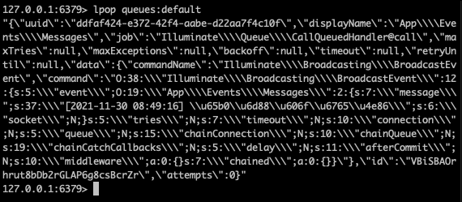
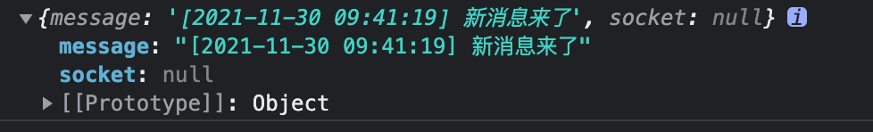
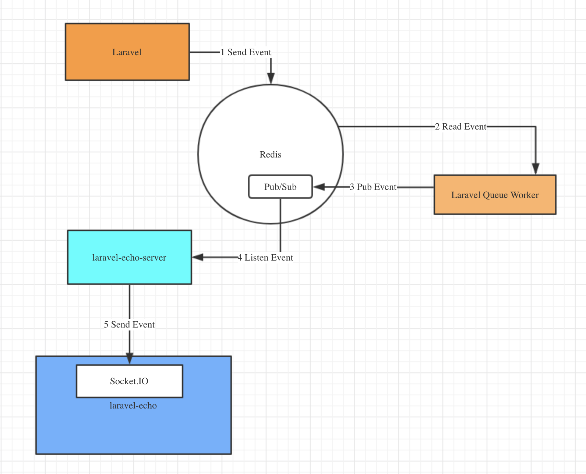

# 广播系统

广播系统指的是什么呢？在这里我们说的广播系统其实就是配合 WebSocket 实现的即时更新接口。什么意思呢？比如说在你的购物 App 上，如果订单状态发生了变化，比如卖家发货了，那么马上就会收到一条通知信息。当然，App 上使用的不是 WebSocket ，而是不同平台的推送机制，但它也是一种广播通知机制。如果你对 Redis 比较了解的话，也可以这么理解：它和 Redis 中的 Pub/Sub 也非常像，前端 SUBSCRIBE 监听频道，后端向频道里 PUBLISH 数据，就是这么个过程。

在 Web 页面开发的领域，现在 WebSocket 可以说已经相当于是事实标准了。之前我们如果要在后台做上一个广播通知功能的话，都是使用 Ajax 去轮询请求，但现在这么做的人已经不多了，毕竟 WebSocket 是更加可靠和高效的选择。至于说为什么 WebSocket 更好，这不在我们讨论的范围内，大家可以自行查阅相关的资料。

今天的内容就是简单的搭起广播系统的环境即可，源码不多说了，因为广播系统实际上是使用了我们之前学习过的队列和事件来实现的。而且它也牵涉到一些前端相关的内容，这一块对于我来说并没有太深度的研究，所以大家看看就好哈。（说实话：实力不允许啊~~~~）

## 服务端配置

默认情况下，Laravel 框架中的广播功能是关闭的。现在我们需要先去打开广播服务提供者，它就在 config/app.php 中。

```php
App\Providers\BroadcastServiceProvider::class
```

将 providers 中的这个服务提供者的注释打开，我们就可以使用广播相关的组件了。然后我们还需要进行一些配置。广播相关的配置在 config/broadcasting.php 中。

```php
return [

    'default' => env('BROADCAST_DRIVER', 'null'),

    'connections' => [

        'pusher' => [
            'driver' => 'pusher',
            'key' => env('PUSHER_APP_KEY'),
            'secret' => env('PUSHER_APP_SECRET'),
            'app_id' => env('PUSHER_APP_ID'),
            'options' => [
                'cluster' => env('PUSHER_APP_CLUSTER'),
                'useTLS' => true,
            ],
        ],

        'ably' => [
            'driver' => 'ably',
            'key' => env('ABLY_KEY'),
        ],

        'redis' => [
            'driver' => 'redis',
            'connection' => 'default',
        ],

        'log' => [
            'driver' => 'log',
        ],

        'null' => [
            'driver' => 'null',
        ],

    ],

];

```

在这个配置文件中，我们可以看到有许多不同的广播连接驱动。pusher 是官方文档上推荐的，但是，注意这里有但是了哦。这玩意需要去它的官网上注册之后拿到 key 了才能使用。而在这们日常的使用中，其实更多的会使用 redis+socket.io 这种搭配。不过问题就来了，在 Laravel8 相关的文档中，关于 redis 和 socket.io 的内容基本上没了。所以我们需要去参考 Laravel6 以及更低版本的文档。这个大家在查阅的需要注意哦。

那么接下来我们就使用 Redis 来配置，因此，我们需要在 .env 中将 BROADCAST_DRIVER 设置为 Redis 。

通过以上的配置，广播相关的配置就完成了。接下来我们需要定义一个事件，并使用队列去消费它，前面没说错吧？广播在服务端就是通过事件和队列来处理的。

```php
namespace App\Events;

use Illuminate\Broadcasting\Channel;
use Illuminate\Broadcasting\InteractsWithSockets;
use Illuminate\Contracts\Broadcasting\ShouldBroadcast;
use Illuminate\Foundation\Events\Dispatchable;
use Illuminate\Queue\SerializesModels;

class Messages implements ShouldBroadcast
{
    use Dispatchable, InteractsWithSockets, SerializesModels;

    public $message;

    public function __construct($newMessage)
    {
        //
        $this->message = $newMessage;
    }

    public function broadcastOn()
    {
        return new Channel('messages');
    }
}
```

我们新定义的这个事件，需要实现 ShouldBroadcast 接口，然后实现一个 broadcastOn() 方法。在这个方法中，返回一个 Channel 实例，它就是我们要指定广播的频道。在这里我们直接给了一个频道名称为 messages 。另外，在这个事件类中，我们定义了一个公共属性用于接收构造函数传来的参数，在广播事件中，公共属性是可以广播到前端去的。

接下来，我们定义一个路由用于触发广播事件。

```php
Route::get('broadcasting/test', function(){
    broadcast(new \App\Events\Messages("[" . date("Y-m-d H:i:s") . "] 新消息来了"));
});
```

在这个路由中，直接使用 broadcast() 工具函数，传递参数为实例化的 Messages 事件对象，给它的构造函数传递了一条数据。

接下来，我们访问这个路由，然后到 redis 的队列中就可以看到一条数据。



看到了吧，事件加队列的组合就是这样的套路，接下来只需要使用 queue:work 或者 queue:listen 来监听队列就可以了。至此，Laravel 框架的服务端功能我们就完成了。不过，还不是完全完成，因为我们还需要一个 laravel-echo-server 组件来运行起一个 socket.io 服务端。Laravel 队列监听处理后的内容会到 laravel-echo-server 中，并由 laravel-echo 的服务端进行对前端的广播。注意，这个 laravel-echo-server 是一个 npm 工具哦，也就是说，它是一个 node.js 服务器。

```php
npm install -g laravel-echo-server
```

安装完成后进行初始化。

```php
learn-laravel git:(main) ✗ laravel-echo-server init
? Do you want to run this server in development mode? Yes
? Which port would you like to serve from? 6001
? Which database would you like to use to store presence channel members? redis
? Enter the host of your Laravel authentication server. http://laravel8
? Will you be serving on http or https? http
? Do you want to generate a client ID/Key for HTTP API? No
? Do you want to setup cross domain access to the API? No
? What do you want this config to be saved as? laravel-echo-server.json
Configuration file saved. Run laravel-echo-server start to run server.
```

在初始化时选项的内容都是很简单的英文啦，相信各位大佬的英文水平是没问题的。然后我们找到在当前目录下生成的 laravel-echo-server.json 文件，修改 devMode 为 ture 。最后运行起来这个服务。

```php
learn-laravel git:(main) ✗ laravel-echo-server start

L A R A V E L  E C H O  S E R V E R

version 1.6.2

⚠ Starting server in DEV mode...

✔  Running at localhost on port 6001
✔  Channels are ready.
✔  Listening for http events...
✔  Listening for redis events...

Server ready!
```

这时，我们运行起队列监控，然后再请求一下广播路由，会看到 laravel-echo-server 服务的命令行下面已经对刚刚的事件进行了广播。

```php
Channel: messages
Event: App\Events\Messages
```

至此，服务端的工作全部完成。

## 客户端配置

接下来就是客户端的配置，也就是我们前端的配置，在进行配置前，你需要先安装相应的 npm 库。

```php
npm install --save socket.io-client
npm install --save laravel-echo
```

很明显，前端对应的是需要一个 socket.io 的客户端组件和一个 laravel-echo 组件。安装完成之后，需要去修改一下 resources/assets/js/bootstrap.js 。在这个文件中，已经包含了一套注释的 Echo 配置，我们需要打开注释并修改成下面这样。

```php
import Echo from 'laravel-echo';

window.io = require('socket.io-client');

window.Echo = new Echo({
    broadcaster: 'socket.io',
    host: window.location.hostname + ':6001'
    // key: process.env.MIX_PUSHER_APP_KEY,
    // cluster: process.env.MIX_PUSHER_APP_CLUSTER,
    // forceTLS: true
});
```

注意，注意，注意，重要的事情说三遍，现在这里是有坑的哦，我们将在后面解决。大家可以先按这样修改。

修改完成之后，我们需要使用 Laravel 默认的 mix 工具来编译一下前端代码，最后需要加载的文件实际上是 public/js/app.js ，直接使用下面的命令行进行编译即可。

```php
npm run dev
```

执行完编译之后，我们就可以写一个前端页面来进行测试了。在这个页面中，直接引用 app.js 文件即可。

```php
// lresources/views/broadcasting/messages.blade.php
<!DOCTYPE html>
<html lang="en">
<head>
    <meta charset="UTF-8">
    <title>messages</title>
    <meta name="csrf-token" content="{{csrf_token()}}">

    <link href="{{mix('css/app.css')}}" rel="stylesheet">
    <script src="{{mix('js/app.js')}}"></script>

</head>
<body>

<script>
    Echo.channel("messages")
        .listen("Messages", (e)=>{
            console.log(e);
        });
</script>
</body>
</html>
```

Echo 对象就是我们在上面的 bootstrap.js 中定义的那个 window.Echo 对象。在具体的页面中，我们直接去调用它的 channel() 方法，给一个指定的频道名称，然后监听这个频道中的具体事件，也就是我们在 Laravel 中定义的事件类名。在监听的回调函数中，我们打印返回的结果。

最后，定义一个路由来显示这个页面。

```php
Route::view('broadcasting/test2', "broadcasting.messages");
```

好了，前端相关的配置也全部完成了。现在打开这个页面吧。

## socket.io 问题

相信你已经打开了我们刚刚定义的页面，同时要保证队列消费和 laravel-echo-server 也正在运行，这时页面上会不停的轮询一个类似于下面这样的请求。

```php
http://laravel8:6001/socket.io/?EIO=4&transport=polling&t=NrkU5-3
```

在你的请求中参数可能和我的不一样，但如果看到这个请求一直在发，并且 console 里没有报错的话，说明你的前端配置是没有问题的。但是，这时你可以去试试刷新发送广播的页面，这边应该还是无法收到推送过来的消息。这是为什么呢？

好吧，这个坑其实我也找了半天才了解到大概的原因，那就是我们在上面通过 npm 安装的 socket.io-client 版本太高了。我这里查看 package.json 的话是 4.4 版本的，而 laravel-echo-server 这边只支持到 2.x 版本。所以我们需要降低版本，最简单的方式是注释掉 bootstrap.js 中引入 socket.io 的那一行。

```php
import Echo from 'laravel-echo';

// window.io = require('socket.io-client');

window.Echo = new Echo({
    broadcaster: 'socket.io',
    host: window.location.hostname + ':6001'
    // key: process.env.MIX_PUSHER_APP_KEY,
    // cluster: process.env.MIX_PUSHER_APP_CLUSTER,
    // forceTLS: true
});
```

然后在前端页面上直接引用一个低版本的 socket.io 。

```php
<script src="https://cdn.bootcdn.net/ajax/libs/socket.io/2.3.0/socket.io.js"></script>
```

接下来重新编译 mix 。

```php
npm run dev
```

现在你再打开我们的前端测试页面，就可以看到一个 WebSocket 连接已经建立了，之前那个 http 连接也不会一直轮询了。这种情况，才是正常的情况。

```php
ws://laravel8:6001/socket.io/?EIO=3&transport=websocket&sid=NTZrvzpCSmX_kuuVAAAB
```

好了，去刷新一下广播页面发送广播吧，然后来到测试页面看看 Console 中是不是有输出了。



## 总结

开心不开心，爽不爽，搞了半天总算把这个广播系统调通了吧。相信你的付出一定会带来收获。整个广播系统非常复杂，仅在后端就有事件、队列的应用，而且还开了一个 node.js 服务。而在前端还要注意 socket.io 的版本问题。具体的源码我也就不分析了，毕竟仅对于 Laravel 框架来说，无非就是事件和队列的组合应用。而前端的实力确实还达不到分析库源码的级别，所以这里也就不献丑了。

如果你的系统中有类似的通知需求，完全可以考虑使用这套广播系统来实现了，多少还是比轮询的功能要强大许多，大家多多尝试就能体会到好处。最后我再引用一张某位大佬画的广播系统的关系图。



参考文档：

[https://learnku.com/docs/laravel/8.5/broadcasting/10382](https://learnku.com/docs/laravel/8.5/broadcasting/10382)

[https://learnku.com/docs/laravel/6.x/broadcasting/5159](https://learnku.com/docs/laravel/6.x/broadcasting/5159)

[https://blog.csdn.net/nsrainbow/article/details/80428769](https://blog.csdn.net/nsrainbow/article/details/80428769)

[https://learnku.com/laravel/t/52388](https://learnku.com/laravel/t/52388)