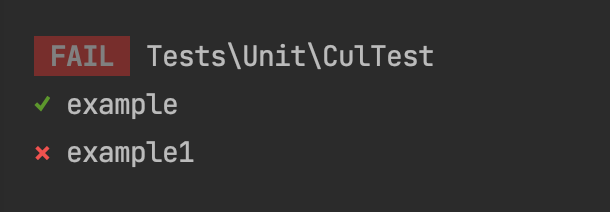
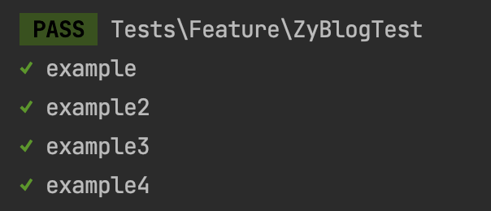

# 测试

测试相关的内容其实也不是我的强项，毕竟日常的开发没怎么接触过，但是不讲吧，又总感觉缺少一点什么，所以这一块也只是简单的演示一下，没办法带大家进行更加深入的学习。

很神奇吧，工作十来年，没有经历过一个是使用过测试驱动开发的公司，甚至连单元测试在工作中都从来没写过。测试的好处自然不用多说，道听途说也了解过测试驱动开发的种种好处，也期望在后续的工作中能够应用上。在这里，也希望大家尽量能找规模大一些的，开发比较正规的公司，类似的这种开发模式或测试相关的知识也能够学习到更多。

## 运行测试

Laravel 的测试组件，主要也是依赖于 PHPUnit 单元测试组件。这个东西单独拿出来就是可以出一个系列的。之前我也大致的看过，但是就像上面说过的，并没有实际的项目经验，所以看过也就忘了。如果你对这一块有更深入的了解，那么今天的内容其实你也不用再看了。

正因为使用的是 PHPUnit ，所以我们可以通过 PHPUnit 来执行测试，比如下面这个命令。

```php
vendor/bin/phpunit
```

不过它的报告格式是原始的 PHPUnit 格式，在 Laravel 框架中，我们更推荐的是使用是框架自带的一个测试命令。

```php
php artisan test
```

通过跟踪调试，我们会发现这个命令的代码是在 vendor/nunomaduro/collision/src/Adapters/Laravel/Commands/TestCommand.php 文件中，从路径就可以看出，它不是包含在默认的 vendor/laravel 目录下的。我们继续跟踪它的 run() 方法，找到 vendor/symfony/process/Process.php 中的 start() 方法。在这个方法中，如果你是断点调度的话，可以看到它会组合一个命令行语句，也就是 $commandline 。

```php
public function start(callable $callback = null, array $env = [])
{
    if ($this->isRunning()) {
        throw new RuntimeException('Process is already running.');
    }

    $this->resetProcessData();
    $this->starttime = $this->lastOutputTime = microtime(true);
    $this->callback = $this->buildCallback($callback);
    $this->hasCallback = null !== $callback;
    $descriptors = $this->getDescriptors();

    if ($this->env) {
        $env += $this->env;
    }

    $env += $this->getDefaultEnv();

    if (\is_array($commandline = $this->commandline)) {
        $commandline = implode(' ', array_map([$this, 'escapeArgument'], $commandline));

        if ('\\' !== \DIRECTORY_SEPARATOR) {
            // exec is mandatory to deal with sending a signal to the process
            $commandline = 'exec '.$commandline;
        }
    } else {
        $commandline = $this->replacePlaceholders($commandline, $env);
    }

    if ('\\' === \DIRECTORY_SEPARATOR) {
        $commandline = $this->prepareWindowsCommandLine($commandline, $env);
    } elseif (!$this->useFileHandles && $this->isSigchildEnabled()) {
        // last exit code is output on the fourth pipe and caught to work around --enable-sigchild
        $descriptors[3] = ['pipe', 'w'];

        // See https://unix.stackexchange.com/questions/71205/background-process-pipe-input
        $commandline = '{ ('.$commandline.') <&3 3<&- 3>/dev/null & } 3<&0;';
        $commandline .= 'pid=$!; echo $pid >&3; wait $pid; code=$?; echo $code >&3; exit $code';

        // Workaround for the bug, when PTS functionality is enabled.
        // @see : https://bugs.php.net/69442
        $ptsWorkaround = fopen(__FILE__, 'r');
    }

    $envPairs = [];
    foreach ($env as $k => $v) {
        if (false !== $v) {
            $envPairs[] = $k.'='.$v;
        }
    }

    if (!is_dir($this->cwd)) {
        throw new RuntimeException(sprintf('The provided cwd "%s" does not exist.', $this->cwd));
    }

    $this->process = @proc_open($commandline, $descriptors, $this->processPipes->pipes, $this->cwd, $envPairs, $this->options);

    if (!\is_resource($this->process)) {
        throw new RuntimeException('Unable to launch a new process.');
    }
    $this->status = self::STATUS_STARTED;

    if (isset($descriptors[3])) {
        $this->fallbackStatus['pid'] = (int) fgets($this->processPipes->pipes[3]);
    }

    if ($this->tty) {
        return;
    }

    $this->updateStatus(false);
    $this->checkTimeout();
}
```

这个 $commandline 是什么内容呢？

```php
'/usr/local/Cellar/php/7.3.9_1/bin/php' 'vendor/phpunit/phpunit/phpunit' '--configuration=/Users/zhangyue/MyDoc/博客文章/LearnLaravel/learn-laravel/phpunit.xml' '--printer=NunoMaduro\Collision\Adapters\Phpunit\Printer'
```

不惊喜也不意外吧？最终依然使用的是 PHPUnit 的命令行来进行自动化测试的。只不过在这里框架帮我们去调用，并且将执行结果又进行了封装后返回。

好了，现在放开你的断点继续执行吧。Laravel 默认是带了一些测试实例的，你可以看到一些测试成功了，一些测试失败了。接下来，我们就自己定义一个测试。

## 单元测试

单元测试是用于测试某个方法的结果是否符合我们预期的。在多数情况下，对于我们开发人员来说如果是在测试开发驱动的公司，单元测试肯定是必须要写的，而且是最重要的测试内容。那么单元测试一般测什么呢？不是说随便一个方法都要进行单元测试，最需要测试的其实是核心业务逻辑相关的一些功能函数或者类方法。这些比较偏理论了，当然也根据个人和公司的情况有所不同，我们也不深究，直接来看看如何使用架构进行单元测试。

首先，我们需要有一个待测试的方法，你可以随便建一个新类，或者使用已有的类，我这里就使用我们之前建立过的一个 Model ，直接在里面添加一个方法。

```php
class MTest extends Model
{
    public static function testCulAdd($a, $b){
        return $a+$b;
    }
}
```

这里只是演示作用哦，不是说只能测试静态方法。这个方法就实现了一个简单的功能，将两个参数想加。然后我们需要建立一个测试类，你可以用下面这个命令行来实现。

```php
php artisan make:test CulTest --unit
```

执行命令后，会在 tests/Unit 目录下生成一个 CulTest.php 文件。我们接下来就在这个文件中写测试。

```php
class CulTest extends TestCase
{
    public function test_example()
    {
        $this->assertEquals(3, MTest::testCulAdd(1, 2));
    }

    public function test_example1()
    {
        $this->assertEquals(4, MTest::testCulAdd(1, 2));
    }
}
```

我们定义了两个测试方法，注意要以 test_ 开头。两个方法我们都使用 assertEquals() 断言，表示要相等的结果，也就是测试的方法的结果应该和我们期望的结果一致。很明显就能看出，第一个测试方法应该是可以通过的，而第二个方法则可能出现问题。那么我们就来运行一下 php artisan test 看看结果是怎样的。



结果符合我们的预期，整个测试实例是失败的，那是因为其中一个测试方法没有通过断言。关于单元测试的更多断言以及相关的资料，大家可以参考官方文档或者是 PHPUnit 的文档，这里我们就不多说了，继续再看看别的测试方式。

## HTTP测试

HTTP 测试就是模拟请求，可以帮助我们直接实现对页面或接口的测试。是不是感觉很强大。创建 HTTP 测试也可以使用命令行。

```php
php artisan make:test ZyBlogTest
```

是的，你没看错，和单元测试类的区别就是不用加后面那个 --unit 了。也就说，其实 Laravel 框架默认是希望我们多使用这种普通测试的。好了，我们就来简单地测试一下。

```php
class ZyBlogTest extends TestCase
{
    /**
     * A basic feature test example.
     *
     * @return void
     */
    public function test_example()
    {
        $response = $this->get('/');

        $response->assertStatus(200);
    }

    public function test_example2()
    {
        $response = $this->post('/test/post');

        $response->assertStatus(200);
        $response->dump();

    }

    public function test_example3()
    {
        $response = $this->postJson('/test/post/json');

        $response->assertStatus(200)->assertJson(['a'=>1]);
    }

    public function test_example4()
    {
        $view = $this->view('test.test', ['message'=>'ZyBlog']);
        $view->assertSee("ZyBlog");
    }
}
```

第一个测试是直接测试的首页，我们断言只要返回 200 就可以了。这里直接使用 get() 方法就可以完成 get 请求。第二个测试是一个简单的 post 测试，我们通过 dump() 打印出了 post 输出的内容。当然，你也可以使用断言来判断测试内容是否符合我们的要求，比如第三个测试，我们测试 json 接口返回的数据是否符合要求。在这里，还展示出了链式调用的效果。

最后一个页面相关的测试就比较好玩，你只需要建立一个下面这样的页面。

```php
// resources/views/test/test.blade.php
<!DOCTYPE html>
<html lang="en">
<head>
    <meta charset="UTF-8">
    <title>Title</title>
</head>
<body>
{{$message}}
</body>
</html>
```

不需要路由，不需要控制器，直接就可以测试了。测试的结果如图所示。



## 测试命令行脚本

命令行测试很明显，就是测试我们的命令行脚本功能是否正常。在测试前，我们要先准备两个命令行脚本。简单起见，直接使用路由命令行，也就是在 routes/console.php 中直接定义两个命令行脚本。这个东西我们没有说过，不过这里演示一下大家也就能明白是干什么用的了。

```php
// routes/console.php
Artisan::command('testconsole', function () {
    $this->line("Hello ZyBlog");
});

Artisan::command('question', function () {
    $food = $this->choice('选择午饭', [
        '面条',
        '盖饭',
        '火锅',
    ]);

    $this->line('你的选择是：'.$food);
});
```

第一个命令行，直接输出一段文字。第二个则是交互式命令行，会提示让你选择午饭，然后返回你选择的内容。你可以直接运行 php artisan testconsole 或者 php artisan question 看看效果。

然后，我们就来写针对这两个命令行的测试脚本，你可以继续写在 ZyBlogTest 中。

```php
public function test_console1(){
    $this->artisan('testconsole')->expectsOutput("Hello ZyBlog")->assertExitCode(0);
}

public function test_console2(){
    $this->artisan('question')
        ->expectsQuestion("选择午饭", "面条")
        ->expectsOutput("你的选择是：面条")
        ->doesntExpectOutput("你的选择是：盖饭")
        ->assertExitCode(0);
}
```

第一条测试的断言很简单，期望输出是我们给定的字符串，然后命令行退出码是 0 就可以了。因为我们没有做别的设置，所以命令行正常退出的退出码都会是 0 。

第二个测试的断言就比较复杂了。我们可以使用 expectsQuestion() 方法模拟选择输入的内容，然后还是 expectsOutput() 断言期望的输出结果，另外还使用了一个 doesntExpectOutput() 也就是不期望输出的结果，通过一系列的组合断言来决定这个测试用例的通过情况。

这个测试结果我就不截图了，很明显是正常通过的。大家可以自己修改断言或者输出来进行更复杂的测试。

## 总结

通过今天的学习，我们了解到 Laravel 的测试组件其实比我们相像中的要简单易用一些。毕竟它帮我们又进行了封装，我们只需要去建立测试类然后写测试用例方法就可以了。希望我也能够和你们一起在实际的项目工作中用起来。有的时候并不是公司不需要我们就完全不去管了，这种好东西应该是用于约束自己的，即使公司没要求，我们也可以在自己的代码中加入这些测试来提高代码质量，这也是我需要反省的地方。话不多说，大家用起来吧。

测试代码：


参考文档：

[https://learnku.com/docs/laravel/8.5/testing/10415](https://learnku.com/docs/laravel/8.5/testing/10415)